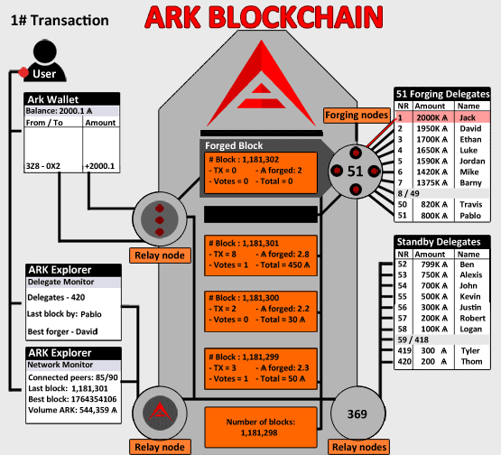

# Understanding Transactions And Block Propagation

[[toc]]

To understand this concept better lets go over a brief explanation of transaction and blocks inside a general blockchain transaction and afterwards we will go over exactly how these function on the ARK network.

A **transaction** is nothing more than the transfer of data from a sender to a receiver through the blockchain network that they are using.   A basic cryptocurrency blockchain **transaction** usually includes information such as...

* Value sent (asset price)
* Ownership information: Who owned this piece of data being sent and who is it going to
* Timestamp of transaction
* Transaction Identification Number

Transaction’s will also reference prior outputs (when it was received by the current sender as an output) to create a new input (showing that data being sent WAS received and validly held by current sender).

Let’s look over an ARK network transaction step by step so you can see how it works

Dustin owned 50 ARK and yesterday Jim sent Dustin 100 ARK.  Dustin now has a balance of 150 ARK in his wallet.

Today Dustin decided to send Cassandra her first 100 ARK.   Dustin will now go into his wallet to initiate the transaction by inputting Cassandra's Public Key (address), Amount of ARK to send (100) and pressing Send.  When he presses send he will have to input his Private Key, which is like a password, and confirms the transaction.

Inside this transaction is a reference to a prior output (Jim sending the 100 ARK) in the input (The 100 ARK being sent to Cassandra) so that the network can verify Dustin has the ARK in his wallet necessary to complete the transaction.

Once the transaction is sent from Dustin's wallet it is broadcast to the network and the **nodes** on the network will help to verify that transaction. This transaction will now be listed on the network and interfaces with the network as "unconfirmed" or "pending".  This basically means that the transaction has not been included in a block of transactions, verified and included in the ARK blockchain by a "forging delegate".

For ease of understanding from now forward in this example, just consider "nodes" and "forging delegates" as verifiers on the ARK network.  If you are interested in learning more about **nodes** consult our section on [Peers and Nodes, what are they and what is their role in the network?](http://www.ark.io/) and for delegates, [What is DPOS and how it relates to other consensus mechanisms](https://docs.ark.io/basics/what-is-delegated-proof-of-stake.html).

A node on the network will check the inputs/outputs of the transaction and verify that Dustin has the ARK necessary to send the 100 ARK plus the transaction fee (more on fees at the end of the section).  once that Node has verified Dustin's transaction as legitimate it signals that determination to the rest of the network.

Once consensus (majority) has been reached that Dustin's transaction is valid, it is sent to the nearest forging delegate to be included in the next **block** on the ARK blockchain.  As described above Forging Delegates are special actors in the network who combine transactions into **blocks** and verify them, writing them permanently into the ARK blockchain on behalf of the network.  Forging delegates are elected via community vote with the delegates who have the 51 highest vote counts given rights as "forging delegates".

The delegate who receives it waits in the que for their turn to forge the next block and once it is their turn, Dustin's transaction, along with any other "unconfirmed" transactions are bundled together and are "forged" into the next block.  Once this block is confirmed as valid by the other delegates/nodes it is written permanently into the ARK blockchain.  Now that this transaction has been included in a forged block it "can" be considered a "Confirmed" transaction.  I say "can" because merchants and exchanges can set thresholds before they will accept a transaction as "confirmed", i.e.  6 confirmations vs 1, etc.

This may sound like a long and complicated process, but in fact it takes **ONLY 8 SECONDS** on the ARK network.

**RECAP**

::: tip
**Transactions** are the sending of data (value) over a network from one individual to another, these transactions are verified by "nodes" on the network and bundled together into **blocks** that are verified by "forging delegates" and permanently written into the ARK blockchain.
:::

## Fees for Transactions

There are various fees for different types of transactions on the ARK network that are listed below.

The ARK network currently charges  the following fees, however they will be lowered after next Core update.

### Vote

**Fee: 1 ARK**

To stake your wallet and vote for a delegate will cost you 1 ARK. If you decided to vote for a different delegate you will need to unvote and vote again for a new delegate, each of these transactions will cost 1 ARK.   So if spent 1 ARK to vote for delegate A yesterday and today you decide to vote for delegate B the unvoting of delegate A will cost 1 ARK along with another 1 ARK to vote for delegate B.

### Transactions

**Fee: 0.1 ARK**

This includes all normal transactions on the network such as send ARK from one wallet to another, on and off exchanges, etc.  For other transactions such as using ARK Contract Execution Nodes (ACES) nodes, those fees will be dictated by the ACES node you are connected to.  For more information on what ACES nodes are and how they bridge functionality between ARK and Ethereum refer to our blog post on them [ACES Nodes](http://www.blog.ark.io/aces-ark-contract-excution-services-d6924486b8c5)

### Register 2nd Passphrase

**Fee: 5 ARK**

When you set up your ARK wallet you will be prompted to write down a 12 word mnemonic passphrase.  This is the private key to your wallet, without which you will be unable access or move any of your funds.  ARK allows for users to register for a "second" passphrase which is an additional 12-word mnemonic phrase for enhanced security of your wallet and funds.

### Delegate Registration

**Fee: 25 ARK**

Delegates are individuals who are vying for community votes to become forging delegates who confirm blocks of transactions on the ARK blockchain.  Anyone is free to run as a delegate and seek votes from the community however only those who maintain the 51 highest vote counts become active forging delegates.

When registering as a delegate you will choose a delegate name that is forever associated with this account.  Your delegate name cannot match an already registered delegate name and be under 20 characters (only lowercase, numbers and special characters are allowed).  To learn more about Delegated Proof of Stake and how it works refer to our section on [What is DPOS and how it relates to other consensus mechanisms](https://docs.ark.io/basics/what-is-delegated-proof-of-stake.html)

### Smartbridge Transactions

**Fee: Varying**

Smartbridge technology is the pillar of innovation underlying the ARK network, allowing for cross blockchain transactions using ARK as the medium.  Currently every blockchain is like an island city state with no way to transact or interact with each other.  ARK's Smartbridge technology will allow for you to engage every blockchain or even multiple blockchain's using what are called "Encoded Listener Nodes".  These nodes allow you to send ARK to them and be swapped for the other blockchain's medium of exchange such as Bitcoin or Ethereum and use that networks functionality and reach through these nodes but stay within the ARK ecosystem, making ARK a de facto hive mind of the blockchain space.  Soon you will never need to leave ARK to operate and transact within ANY other blockchain.

Encoded Listener Nodes (ECL) operate by containing certain amounts of the coins/tokens that the blockchain it is connected to uses.  Say you wish to pay a supplier 1 ETH for services rendered via the Ethereum smart contract you have created for your business.  If ARK is valued at 250 ARK per 1 Ethereum you can send 250 ARK to the ECL you have chosen, who then converts that ARK to Ethereum and sends that over the Ethereum blockchain to fulfill that smart contract and pay that employer.  If that supplier realizes they overcharged you, they can also refund you .1 Ethereum and through that ECL the 25 ARK are returned to your wallet.  Encoded Listener Nodes are run independently so the fees are set by the operator of that node.  Very soon in the future ECL operators will run on a network that users can access, review fee structures, size limitations, history, etc. and choose which node best fits their needs.  Market competition between node operators will keep fees rigorously competitive and a rough standard market rate for fees may emerge at a later date.
