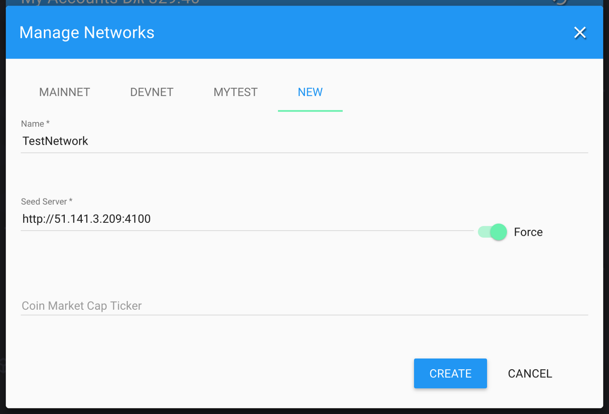
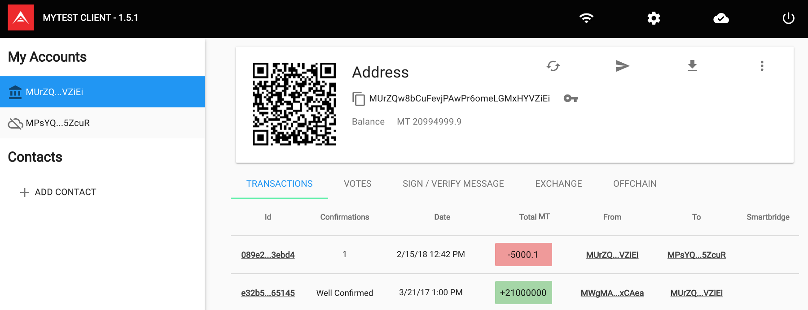
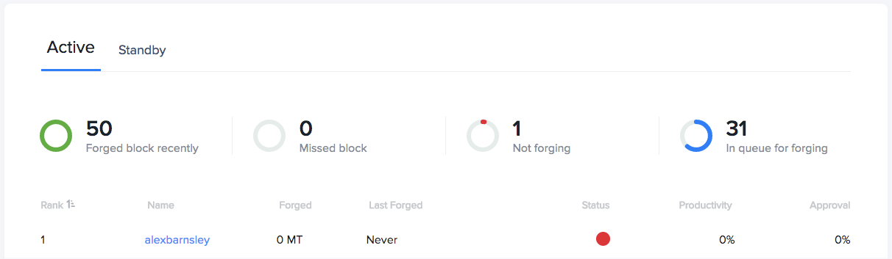
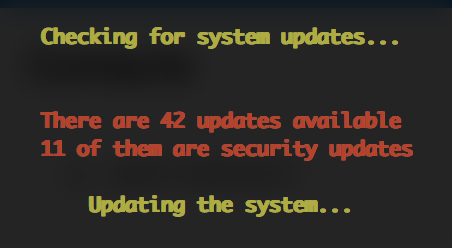
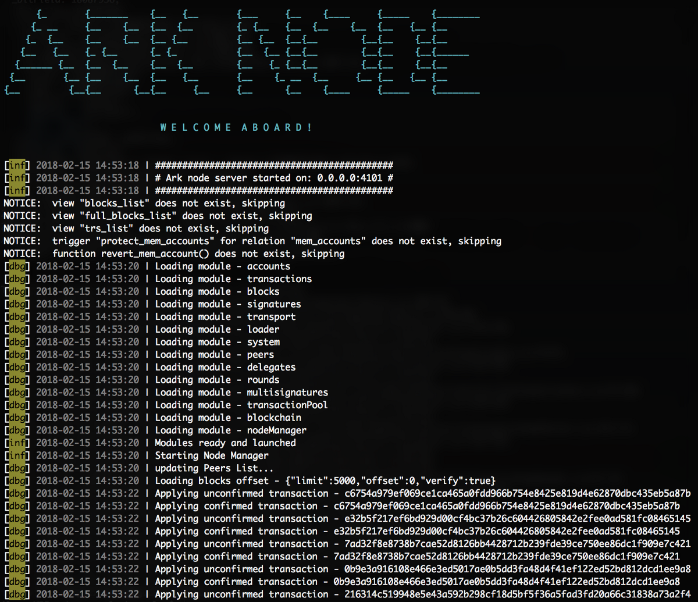

# Ark BridgeChain Setup Guide

[[toc]]

::: tip
**This guide is to help you get setup with your own Ark BridgeChain. It will focus on launching your own Ark clone BridgeChain, auto-forging setup, adding your own delegate nodes and making it accessible via the Ark wallet.**
:::

## Setting up your BridgeChain Node

The nodes are a core part of the network. They are what forge the blocks, validate transactions, provide API access to the data contained within the network, and ultimately what keeps everything running and secure.

**Remote into your machine using SSH**


::: tip Download Ark Deployer
```bash
cd ~
git clone https://github.com/ArkEcosystem/ark-deployer.git
cd ark-deployer
```
:::

::: tip Install NodeJS and NPM
```bash
curl -o- https://raw.githubusercontent.com/creationix/nvm/v0.33.8/install.sh | bash
source ~/.profile
nvm install 8.9.1
sudo apt-get update && sudo apt-get install -y jq
```
:::

::: tip Install & Setup Your BridgeChain
```bash
./bridgechain.sh install-node --name MyTest --database ark_mytest --token MYTEST --symbol MT --node-ip 51.141.3.209 --explorer-ip 51.141.3.209 --autoinstall-deps
```

**Note: Use your Public IP here**
:::

There are many more options available when installing the node, which can be found [here](https://github.com/ArkEcosystem/ark-deployer#optional-parameters). You can also use a JSON config file, which you can learn about [here](https://github.com/ArkEcosystem/ark-deployer#json-config). Any changes to fees or the epoch time of the network currently prevent the Desktop Wallet from working with your chain.


Once installed you will see output similar to this. Passphrase is the genesis passphrase which contains all pre-mined tokens. You will need this in order to distribute tokens to other wallets.

::: tip Start the BridgeChain
```bash
./bridgechain.sh start-node --name MyTest
```

**Note: --name is important as it relates to the config files for your chain**


## Setting up your BridgeChain Explorer

The explorer is used to view information on your BridgeChain. It provides details about the delegates that are active and on standby. It also provides information about all the addresses, transactions and blocks that are available. In summary, everything you need to know about your BridgeChain can be found in the explorer.

::: tip Install Explorer (Not Azure)
```bash
./bridgechain.sh install-explorer --name MyTest --token MYTEST --node-ip 51.141.3.209 --explorer-ip 51.141.3.209 --skip-deps
```
:::

::: tip Install Explorer (Azure)
You will need to choose your Private IP for the explorer. You can run `ipconfig` to find it.

```bash
./bridgechain.sh install-explorer --name MyTest --token MYTEST --node-ip 51.141.3.209 --explorer-ip 10.0.0.4 --skip-deps
```
:::

::: tip Start Explorer (in the background)
```bash
./bridgechain.sh start-explorer
```
:::

::: tip Start Explorer (in the foreground)
```bash
cd ~/ark-explorer
npm run bridgechain
```
:::


Once the explorer is running, you can give it a test by navigating to it through your browser.


## Adding the BridgeChain to your Desktop Wallet

Having a BridgeChain is great, but you'll probably to interact with it and send out some of your genesis tokens. This will be required when forging with new delegate nodes (instead of auto-forging).


From your desktop wallet, go to Settings (the gear icon at the top-right) and choose “Manage Networks”.



Go to the “New” tab, give your network a name, input the URL of your BridgeChain node (including “http://” and leaving the “/” off the end), and then enable “Force”. The Force option means the desktop wallet will always connect to this peer when dealing with the Network, and won’t deal with any Peers. Once done, click on the “Create” button.


You are then presented with all the details for your Network. Click on the “Save” button here.


From the Networks (Wi-Fi Icon at the top-right), change to your newly created Network.


Now import your genesis passhprase which you was given when installing your node and click “Import”.


You will notice your wallet now has the pre-mined tokens already there and available. You can send those tokens to a new wallet straight away.


Generate a new wallet, and send some tokens from your genesis wallet.



You will notice the genesis wallet is no longer a cold wallet (a cold wallet has no public key), and our transaction sent correctly.


## Adding a Forging Delegate to the Network

Using the desktop wallet and our new address that we just set up, we will register as a delegate and set up a new node so we are forging external to our seed node. This section requires some command-line experience.

##### Register as a Delegate


In the wallet you want to register as a delegate, click on the Menu Icon (3 vertical dots at the top-right).


Then choose the “Register Delegate” option.


Enter your desired delegate name, and input your passphrase. You can then submit that transaction to the network.


Reload your desktop wallet and you will see your wallet is now a delegate.

##### Voting for your new Delegate
Because we’re in an auto-forging state, we don’t need to vote for ourselves. That being said, it’s worth doing anyway.


In the new Delegate Wallet, go to the Votes tab and click on the “Vote” button.


Find yourself in the delegate list and enter your passphrase. You can then press “Next” and send the transaction.


You will then see information about yourself in the Votes tab.



You will also see your Delegate showing in the Explorer Delegate Monitor.

##### Setup a forging Node

You will need a new machine ready for us to setup. To make it easier, we will use ArkCommander to setup all dependencies then overwrite with our BridgeChain configuration.

::: tip Download and run ArkCommander
```bash
wget http://ark.io/ARKcommander.sh
bash ARKcommander.sh
```

**Enter your user password to gain root privileges if/when asked.**
:::



Your system will then update ready for a node. This can take a while but if you find there’s no response, you can restart this process and try again.


Once finished, reboot your machine with `sudo reboot`

::: tip SSH back into your delegate machine and run ARKcommander
```bash
bash ARKcommander.sh
```
:::


Once started, press “1” and Enter to install Ark Node. This ensures we have all the dependencies we need for the node installed. Once finished, input “Y” to setup logrotate and press Enter to continue.


Input an empty secret if asked, and “Y” then Enter to apply config. Press Enter again to go back to the main menu. Then input “0” and press Enter a final time to Exit the ARKCommander.

There will now be the MainNet Node setup in ~/ark-node.

::: tip Remove the current ark-node
```bash
rm -rf ~/ark-node/
```
:::

::: tip Copy Node files over SSH (this can take a while)
```bash
scp -r bridgechain@51.141.3.209:~/ark-bridgechain ~/ark-node
```

**Note: You will have to change the username and IP to the auto-forging node you’re copying from. You will also have to change the path you’re copying from if you chose to install the BridgeChain somewhere different.**
:::

::: tip Navigate to the Node folder
```bash
cd ~/ark-node
```
:::

::: tip Update the config file in an editor of your choice
```bash
vi ~/ark-node/config.MyTest.json
```

- Change `port` to *4101*
- Change `db.database` to *ark_bridgechain*
- Check the `peers.list` already has the IP for your Seed node (see below image)
- Change `forging.secret` to `["YOUR PASSPHRASE"]`
:::


::: tip Remove packaged files (which were installed on seed node)
```bash
rm -rf package-lock.json node_modules/
```
:::

::: tip Re-install local dependencies for the Node
```bash
npm install libpq
npm install secp256k1
npm install bindings
npm install
```
:::

::: tip Create Postgres Database for our BridgeChain to use
```bash
createdb ark_bridgechain
```
:::

::: tip Run the Node (in the background)
```bash
forever start app.js --genesis genesisBlock.MyTest.json --config config.MyTest.json
```
:::

::: tip Run the Node (in the foreground)
```bash
node app.js --genesis genesisBlock.MyTest.json --config config.MyTest.json
```
:::




**The Peers API show the auto-forging machine and the Delegate Node**

You can access this by going to the /api/peers endpoint. E.g. http://51.141.3.209:4100/api/peers (seed node) or http://51.143.157.13:4101/api/peers (delegate node)

```json
{
  "success": true,
  "peers": [
    {
      "ip": "51.143.157.13",
      "port": 4101,
      "version": "0.0.1",
      "errors": 0,
      "os": "linux4.13.0-1009-azure",
      "height": 2676,
      "status": "OK",
      "delay": 5
    },
    {
      "ip": "51.141.3.209",
      "port": 4100,
      "version": "0.0.1",
      "errors": 0,
      "os": "linux4.13.0-1007-azure",
      "height": 2676,
      "status": "OK",
      "delay": 14
    }
  ]
}
```

##### Summary
To conclude, we have just set up our first forging delegate node. This means we can start adding more nodes to the network, and gradually move away from the auto-forging setup that we have. Due to the performance of the machines we used in this case, it is very possible for the delegate node to stop syncing, or to struggle to keep up-to-date. In reality, the network needs a lot of relay nodes to ensure other nodes can continue to receive blocks.

##### Your Next Steps
1. Move all pre-mined tokens into a new wallet of which only you know the passphrase for (or use a Ledger hardware wallet inside the Desktop Wallet).
2. Commit the new config and genesis files, and put them in a forked GitHub Repository. You can omit the new files in the `~/ark-bridgechain/tasks` folder.
3. Add more relay nodes to the network just as we just have (skipping the delegate step).
4. Consolidate all relay node IP & ports and add them to the `~/ark-bridgechain/config.MyTest.json` file (making sure to commit and update on all nodes). This means the network will start to grow and will build over time, meaning they will stay synced up.
5. Move all delegate forging nodes to their own machines.

## JSON Config File

You can also use a JSON config file to setup both the node and the explorer. You can see more information regarding this here.

## Easy Vagrant Setup

We have also provided a Vagrantfile which allows you to deploy your own BridgeChain and Explorer together with no configuration necessary.

** Note: This requires Vagrant version 2+ to be installed from [here](https://www.vagrantup.com/downloads.html).**

::: tip Download Ark Deployer
```bash
cd ~
git clone https://github.com/ArkEcosystem/ark-deployer.git
cd ark-deployer
```
:::

::: tip Initiating a Vagrant Machine
```bash
vagrant up
```
:::

::: tip Destroying a Vagrant Machine
```bash
vagrant destroy
```
:::

##### Tweaking BridgeChain Options (Advanced)
Open up `~/ark-deployer/vagrant/config.json` and you will see all the possible options that you can change. These are all used when deploying the BridgeChain on Vagrant and can be customised. Refer to the [node options](https://github.com/ArkEcosystem/ark-deployer#optional-parameters) and [explorer options](https://github.com/ArkEcosystem/ark-deployer#optional-parameters-1) before continuing to get an idea of what each do. Once you are happy with your settings, go ahead and start the Vagrant environment as above.

## Ark’s Next Steps

We will be updating deployer to work with Ark Core v2 once it is in the testing phase. Aside from other improvements to ark-deployer (which will also be updated in this guide if needs be), we will also be building a Push Button deployment interface which will give a friendly user experience, and do all the things discussed in this guide for you, just at the click of a few buttons.

## FAQ

1. **Why do I need to “Force” my Network in the Desktop Wallet?**
When your BridgeChain node is auto-forging, it uses loopback addresses (127.0.0.x) to connect to itself and act as a forging node. If the Force option isn’t enabled, the Desktop Wallet will try to connect to the loopback addresses as they show as peers when querying the /api/peers endpoint. Forcing a connection means you connect directly with your BridgeChain seed node, instead of having to launch a range of relay nodes to serve as peers.
2. **I lost my Genesis Passphrase. Where can I find it?**
Take a look in ~/ark-bridgechain/tasks/demo/genesisPassphrase.MyTest.json. You will find it in there (unless you removed it).
3. **Will Deployer work on XYZ Operating System?**
We recommend only running the Ark Node on Ubuntu 16.04. It may be possible on other Operating systems, but it is more specifically tested/used on this Operating System.
4. **Can I change the fees for my BridgeChain?**
Yes you can which can be found under node options, however this causes issues with the Desktop Wallet (and anything that uses the ark-js package).
5. **What is a Seed Node?**
A Seed Node is used as a master node. Something that is used as a basis for Nodes to connect with, to then become “attached” to the Network.
