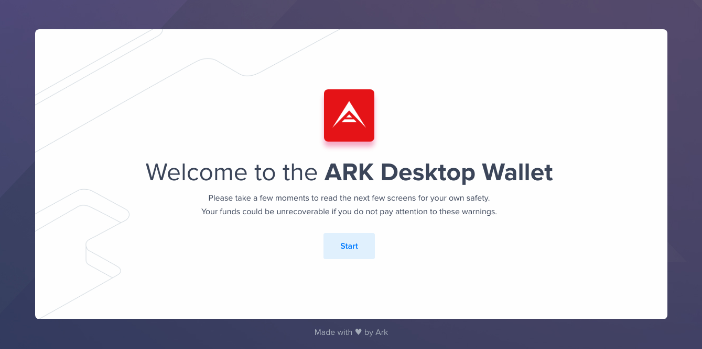
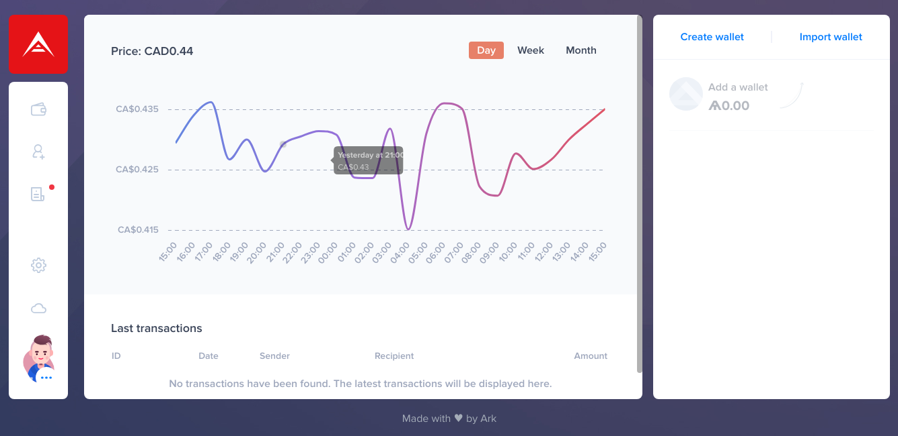
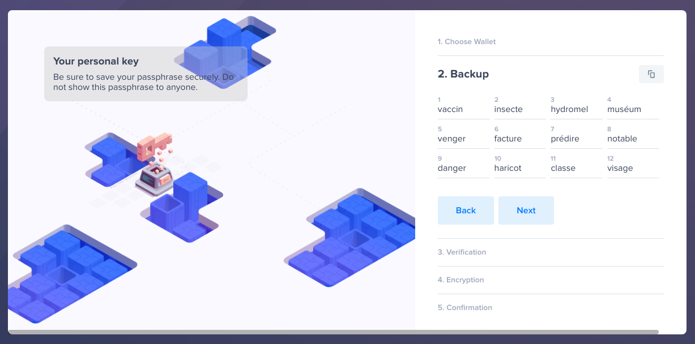
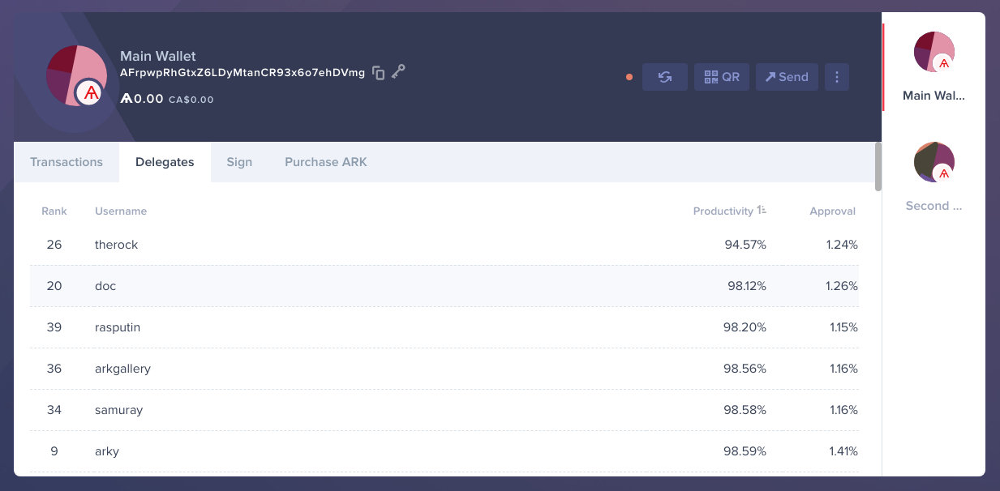
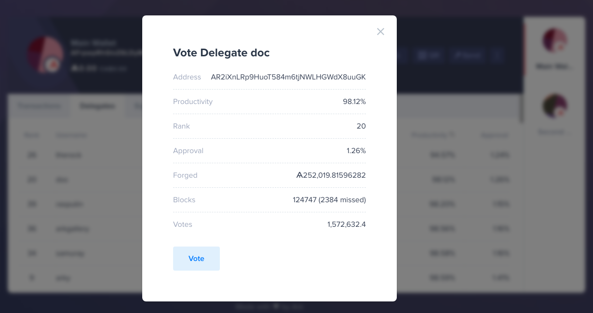
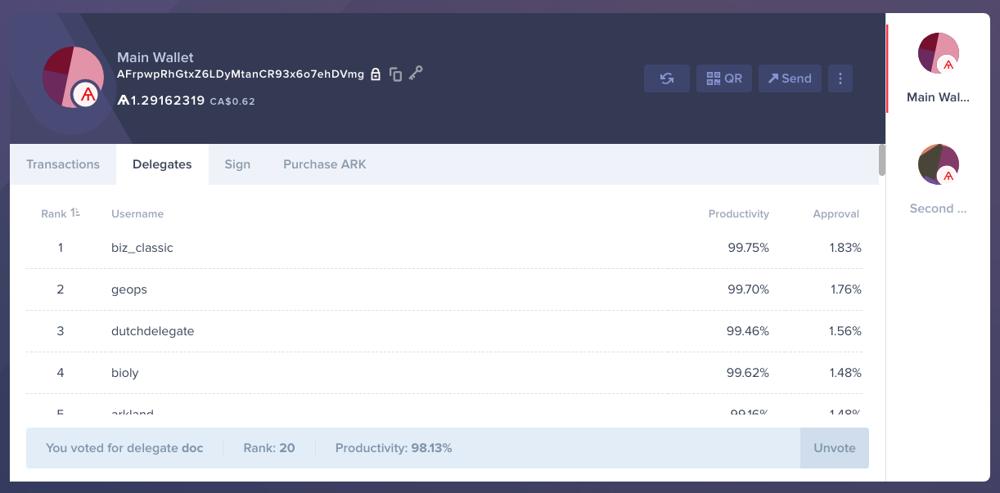
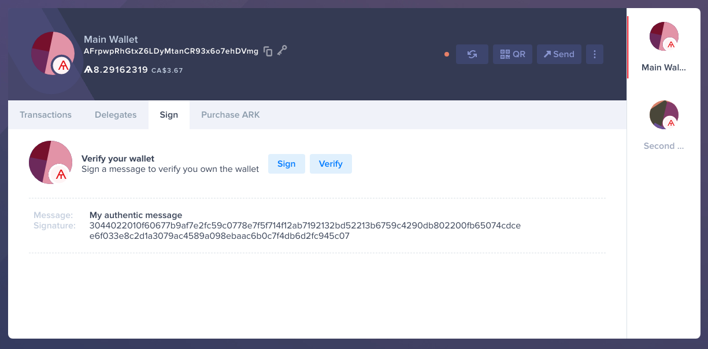
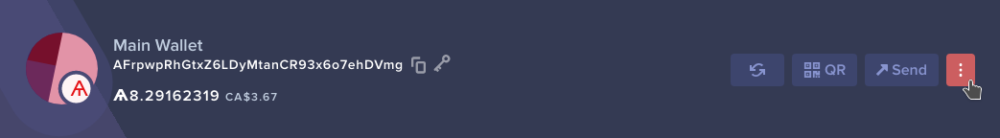

# How to Use the Desktop Wallet

[[toc]]

### What is it?

The Ark Desktop Wallet is an application which allows you to manage Ark transactions. It provides extensive functionality, including management of profiles and wallets, creation of both online and offline transactions, wallet summary, stylistic customizations, multilingual support, various currency integrations including BTC and much more!

### First things first...

To download the application, you can visit the link below and select the appropriate release for your computer's platform. Ark Desktop Wallet is available for Windows, Mac and Linux.

[Ark Desktop Wallet releases](https://github.com/ArkEcosystem/ark-desktop/releases)

::: warning
**Note**: The above link is the authoritative source for Ark Desktop Wallet releases. As a friendly reminder, don't ever click on links that are not provided by the Ark Team.
:::

When you arrive on this page you will see multiple download options. Select the one that reflects your operating system:

## Getting Started

After opening the Ark Desktop Wallet application for the first time, you will be greeted with security instructions. Please read every slide, as each one provides important details on how you can better protect your funds.

Once you've read through the welcome instructions, you will be presented a page on which you can create your first profile. This is a multiple-stepped process in which you enter or select:

 -  **Profile details**
    - Your chosen profile name
    - The application's language and currency settings
    - Which language to use for [12-word BIP39 Passphrase](https://en.bitcoin.it/wiki/Seed_phrase)
    - One of many amazing avatars

 -  **Network**
    - Which network to operate on, either the normal Ark network or the Ark Devnet (for developers)

 -  **Appearance**
    - The Light or Dark theme
    - Your favorite background design

Upon successfully creating your profile, you will be brought to te dashboard.

## News and Important Updates
There's a dedicated section provided by the Ark Desktop Wallet that is dedicated to news and other relevant updates in the Ark Ecosystem. Often, you will receive new blog posts in this section, which can be access via clicking the newspaper icon in the wallet's navigation bar.

## Creating or Importing your Ark Wallet

The Ark Desktop Wallet allows you to both create new wallets and import existing ones. You can begin either process by clicking the appropriate button at the top of the sidebar when on the app dashboard.

### Creating a New Wallet
 - **Pick an address to claim**

 - **Save your 12-word BIP39 Passphrase**

 - **Prove that you have saved your Passphrase**

 - *(Optionally)* **require a password to decrypt the Passphrase for an added layer of security**

 - *(Optionally)* **name the new wallet and copy its address**

### Importing your Wallet

 - **Import your wallet by providing its address, passphrase, or both**

 - *(Optionally)* **require a password to decrypt the Passphrase for an added layer of security**

 - *(Optionally)* **name the new wallet and copy its address**

## Wallet Interface

The wallet interface page can be reached by clicking on the wallet icon in the navigation bar of the application. On it, you will be able to view your profile or individual wallet balance. Some shortcuts are also provided to create or import a wallet and view the details of one of your wallet.

### Wallet details
On the wallet detail page, which is accessed by clicking on the wallet's name or icon from the wallet interface, you can: 
 - send an ARK transfer
 - view and sort the wallet's transactions
 - vote for a registered delegate
 - sign and verify messages cryptographically
 - purchase ARK through [Changelly](https://changelly.com)
 - register a second passphrase for added security
 - register the wallet as a delegate

### Sending an ARK transfer

Transferring ARK from your wallet is the most common type of transaction.

You can easily send a transfer by clicking on the ***Send*** button in the header of the wallet detail page. This will bring up a prompt, on which you can fill in the required information to create a transfer transaction.

Upon clicking ***Next***, you will then have to review the transfer transaction's details and decide whether to submit it, discard it or save it by clicking ***Send***, ***Back*** or ***Save***.

### Voting for a Registered Delegate and Unvoting

Delegated Proof of Stake, the consensus algorithm used by the Ark Core, requires network participants to vote for delegates with their funds. A vote is not like a transfer, it is simply helps determine which delegates have the most support from network members. You may only vote for one delegate at a time and your funds are not locked while you are voting.

***Voting***
 - **Browse the list of registered delegates**

 - **Choose the delegate you wish to vote for, review their statistics and click *Vote***

 - **Fill in the required vote transaction fields and click *Next***

 - **Submit, discard or save the vote transaction by pressing either *Send*, *Back* or *Save***

***Unvoting***
 - **Open the list of registered delegates**

 - **Click on the *Unvote* button**

 - **Review the delegate's stats and click the *Unvote* button**

 - **Choose a transcation fee, enter your security details and click *Next***

 - **Submit the unvote transaction and Submit, Cancel or Save it by clicking either *Send*, *Back* or *Save***

### Signing and Verifying Messages

With the magic of cryptography, you are able to create and sign a message that other users will be able to verify as authentically yours.

Message signing and verifying is all done under the **Sign** tab of the wallet detail page.
#### Signing a Message

With a signed message, others can verify that a given message and signature combination originate from you.

 - **Input your security details and the message to sign, then click *Sign***

 - **Your signed message will appear under the Sign tab of the wallet detail page**

#### Verifying a Message

To verify a message that was signed by a different wallet, you need the wallet's public key, the original message and the resulting signature.

:::tip
The public key of a wallet is much like the address, except it doesn't follow the same format and is not shown by default in the Desktop Wallet. You can view your wallet's public key by clicking the key icon next to your wallet's address in the wallet detail page's header.
:::

For demonstration purposes, the images below are shown from the perspective of a second wallet, assuming the necessary details to verify the message were provided to the verifying user.

 - **Enter the message to verify, the public key of the wallet which was used to sign the message and the resulting signature, then click *Next***

 - **See whether the message was successfully verified or not**

### Register as a Delegate

Registering as a delegate is a simple transaction. It provides network nodes with a record of the sending address opening itself to accept votes from other wallets. You can only vote for an address that was registered in this fashion.

 - **Expose more options in the wallet detail page by clicking the icon in the header**

 - **Click the *Register delegate* button**

 - **Enter your desired Username, Transaction fee and security details; then click *Next***

 - **Verify the delegate registration transaction details and Submit, Cancel or Save it by clicking either *Send*, *Back* or *Save***

### Register a Second Passphrase
Security is very important. By issuing a second signature transaction, you tell network nodes to verify that every transaction coming from your wallet is also signed by another Passphrase.

 - **Expose more options in the wallet detail page by clicking the icon in the header**

 - **Click the *Second passphrase* button**

 - **Save your 12-word BIP39 second Passphrase and click *Next***

 - **Prove that you have saved your second Passphrase, select your desired transaction fee, enter your security details and click *Next***

 - **Verify the second signature transaction details and Submit, Cancel or Save it by clicking either *Send*, *Back* or *Save***

