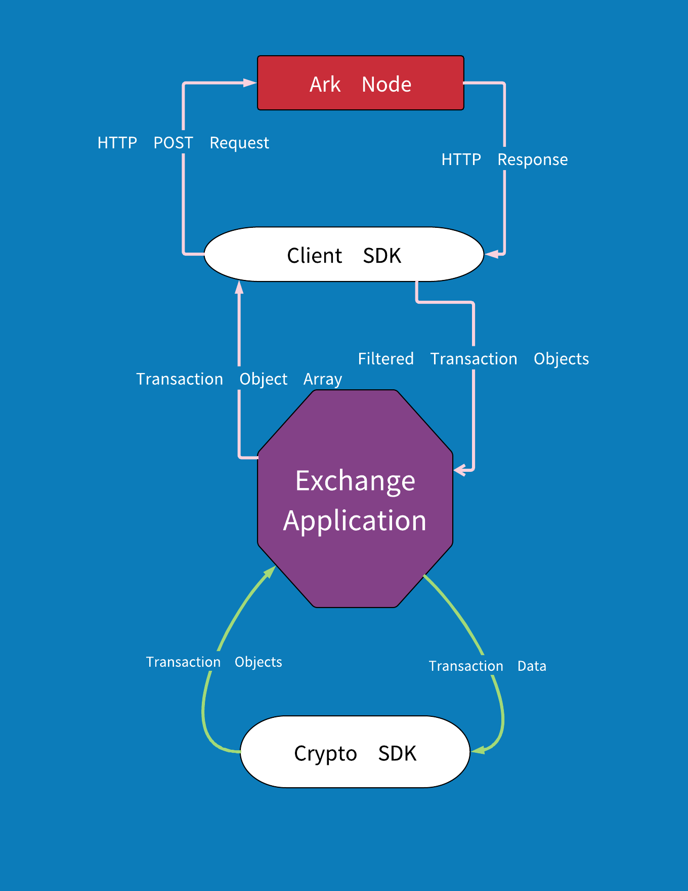
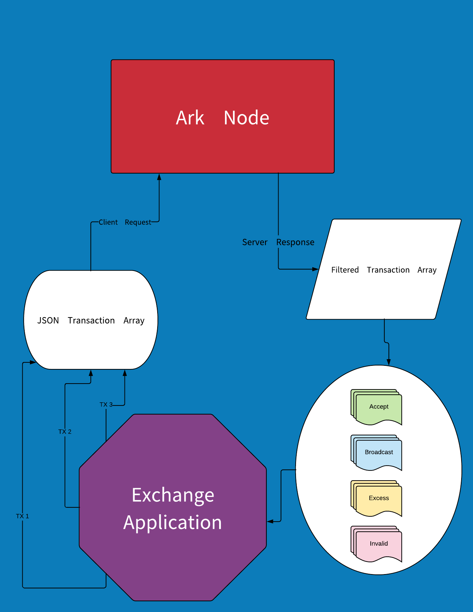

# Public API Quick Actions

Connecting to the API is done via the Crypto and Client SDKs. Many informational queries can be done using the Client SDK alone, while any actions requiring cryptographic functionality (ie. signing transactions) require the use of the Crypto SDK.

At a surface level, the two SDKs are separated by their functions and intended use cases:

- The Crypto SDK provides the cryptographic functions necessary to authenticate and validate Ark transactions.
- The Client SDK provides wrapper functions to unify and streamline API calls between your application and the Ark blockchain.

Put another way, the Crypto SDK structures your data in a format that all Ark nodes can understand, while the Client SDK handles the actual communication between your application and an Ark node. Where the Crypto SDK is internal, the Client SDK is external, as the below diagram illustrates:



While the below examples are written using Node, there are SDKs available for a wide variety of popular languages, all of which follow the conventions outlined here.

## Setup

These quick actions will all assume you've loaded a Client instance with the IP address of your node and the API version you're requesting.

In JavaScript, this is:
:::: tabs

::: tab javascript
```js
const Client = require('@arkecosystem/client')
const exchangeClient = new Client('YOUR.NODE.IP', 2)
```
:::
::: tab java
```java
import org.arkecosystem.client.Connection;
import org.arkecosystem.client.api.two.Two;
import org.arkecosystem.crypto.configuration.Network;
import org.arkecosystem.crypto.networks.Devnet;
import org.arkecosystem.crypto.networks.Mainnet;
import org.arkecosystem.crypto.transactions.Transaction;
import org.arkecosystem.crypto.transactions.builder.Transfer;
```
:::

::::
## Check Wallet Balance

Checking a wallet balance involves using the `wallets` resource to `get` the wallet corresponding to a given Ark address.
```js
const walletAddress = 'ARKADDRESS' // get address from user 
let wallet 

exchangeClient
  .resource('wallets')
  .get(walletAddress)
  .then(response => {
      wallet = response.data.data
  })
  .catch(error => {
    console.log(error)
  });

console.log(wallet.balance)
```

## Find Block Information

If you know the ID of the block you are looking for, you can use the `get` method on the `blocks` resource to return information on that block.
```js
let block 

exchangeClient
  .resource('blocks')
  .get(blockId)
  .then(response => {
      block = response.data.data
  })
  .catch(error => {
    console.log(error)
  });

console.log(block)
```
Alternatively, if you are not sure of the block ID, or if you want to find all wallets in a range, you can make use of the `wallets.search` method. This endpoint accepts a JSON object representing the search parameters to use when narrowing down a list of blocks.

The following block qualities can be used to create your range:

- timestamp
- height
- numberOfTransactions
- totalAmount
- totalFee
- reward
- payloadLength

To use any of these qualities as a range, include the relevant key in your request as an object containing `from` and `to` properties.

For example, this code can be used to search all blocks between blockchain heights 720 and 735 with total fees between 0 and 2000 arktoshi:
```js
exchangeClient
  .resource('blocks')
  .search({
    height: {
      from: 720,
      to: 735
    },
    totalFee: {
      from: 0,
      to: 2000
    }
  })
  .then(response => {
    console.log(response.data) // all blocks matching the search criteria
  })
```
## Create and Broadcast Transactions

To create transactions, make use of the **transactionBuilder** module of `@arkecosystem/crypto`. First, install the package from npm:
```sh
yarn add @arkecosystem/crypto
```
The `crypto` package functionality we'll use here is the transactionBuilder, which provides a series of "chainable" methods that can be called, one after another, to produce a transaction object. These methods create and define your transaction: its type, its amount in arktoshis, its signature, and more.

Regardless of which SDK you use, every transactionBuilder contains a similar function to `getStruct`, which will return a completed transaction object.

After making one or more of these transaction objects, you can combine them into an array to use as the `transactions` key in your request. 

With all the steps together, here is an example of how to send a transaction for approval:
```js
const crypto = require('@arkecosystem/crypto')
const transactionBuilder = crypto.transactionBuilder

const transaction = transactionBuilder
  .transfer()
  .amount(2 * Math.pow(10, 8))
  .recipientId(recipientId)
  .sign(passphrase)
  .getStruct()

exchangeClient
  .resource('transactions')
  .create({
    transactions: [transaction]
  })
  .then(response => {
    console.log(response.data)

    if (response.data.errors) {
      errors.forEach(error => {
        console.log(error)
      })
    }
  })
  .catch(error => {
    console.log(error)
  })
```

There are a few things worth noticing about the above code. Firstly, the code assumes that you have declared two variables in your code already:

1. `passphrase` - the passphrase of the sending account, used to sign the transaction. This should come from somewhere secure, such as a `.env` file.
2. `recipientId` - the Ark address of the receiving account. This should be provided by the exchange user when submitting withdrawal requests.

Second, when sending your request using the `exchangeClient`, ensure that the value of `transactions` is an array, even if you have only one transaction object.

If your request is successful, you will receive a response with the following `data` key:
```js
{ 
  data: { 
      accept: [ '96e3952b66a370d8145055b55cedc6f1435b3a71cb17334aa954f8844ad1202f' ],
      broadcast: [ '96e3952b66a370d8145055b55cedc6f1435b3a71cb17334aa954f8844ad1202f' ],
      excess: [],
      invalid: [] 
    },
  errors: null 
}
```
Let's look at the returned `data` object in more depth. It is composed of four arrays, each holding zero or more transaction IDs:

1. `accept` - a list of all accepted transactions
2. `broadcast` - a list of all transactions broadcasted to the network
3. `excess` - if the node's transaction pool is full, this lists all excess transactions
4. `invalid` - a list of all transactions deemed invalid by the node

Our sample code above submitted one transaction, which the node accepted and broadcasted. This is why the `accept` and `broadcast` arrays contain exactly one item each: the ID of the transaction we submitted. 

If we had submitted any invalid transactions, the `invalid` list would have contained their IDs, and the `errors` key would have been populated with one error per invalid transaction. 

The diagram below offers a top-level overview of the transaction submission process:



## Check Transaction Confirmations

Once a transaction has been created and added to the blockchain, you can access the number of confirmations it has by using the `transactions` resource to `get` the value matching the transaction ID.
```js
exchangeClient
  .resource('transactions')
  .get(transactionId)
  .then(response => {
    console.log(response.data)
  })
```
If the transaction has been added to the blockchain, you'll receive the following output in your console:
```js
{ 
  data: { 
    id: 'a4d3d3ab059b8445894805c1158f06049a4200b2878892e18d95b88fc57d0ae5',
    blockId: '7236620515792246272',
    version: 1,
    type: 0,
    amount: 200000000,
    fee: 10000000,
    sender: 'ANBkoGqWeTSiaEVgVzSKZd3jS7UWzv9PSo',
    recipient: 'AbfQq8iRSf9TFQRzQWo33dHYU7HFMS17Zd',
    signature: '304402206f1a45d0e8fadf033bfd539ddf05aa33ca296813f30a72a0e17d560e2d04ba8e02204a2525972d14bb3da407a04f2b9d797747a4eb99ff547e4803f60143f6a68543',
    confirmations: 0,
    timestamp: { 
      epoch: 54759242,
      unix: 1544860442,
      human: '2018-12-15T07:54:02.000Z' 
    } 
  } 
}
```
You can see that the `confirmations` key holds the number of confirmations this transaction has received from the network, in the above case 0. As the average block takes  8 seconds to forge, finality is typically established within a minute following a transaction's addition to the blockchain.

## Check Node Status

Checking node status can be done by using the `node` resource's `status` method:
```js
exchangeClient
  .resource('node')
  .status()
  .then(response => {
    console.log(response.data)
  })
```
By running this code, you'd see output in your console resembling the following object:
```js
{ 
  data: { 
    synced: true, // whether this node is fully synced with the network
    now: 14468, // the current network height of this node's blockchain
    blocksCount: 0 // if not synced, the number of blocks yet to be synced
  } 
}
```
If `synced` is true, your node is operating as expected and fully synced with the ARK network. Otherwise, use the `blocksCount` key to get an estimation of how long your node will take to sync.