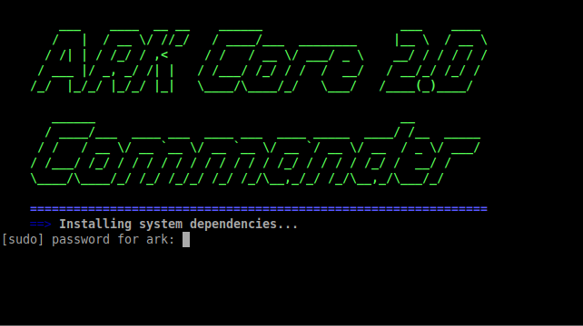
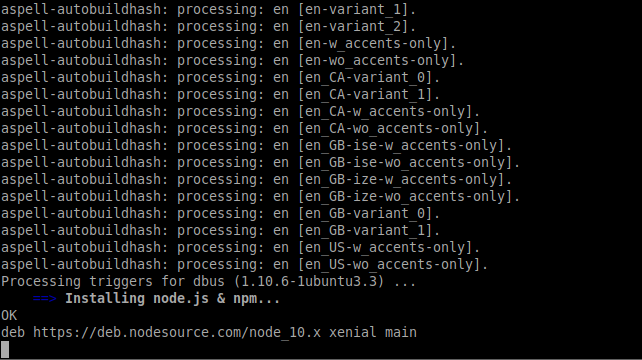
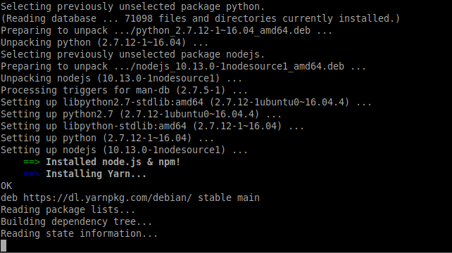
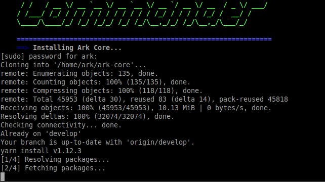
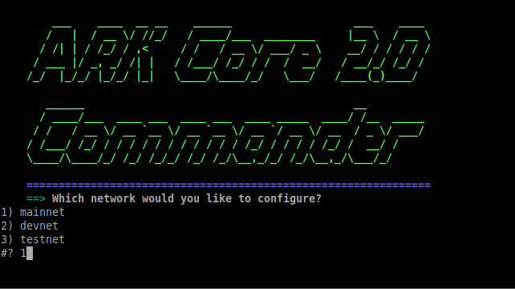
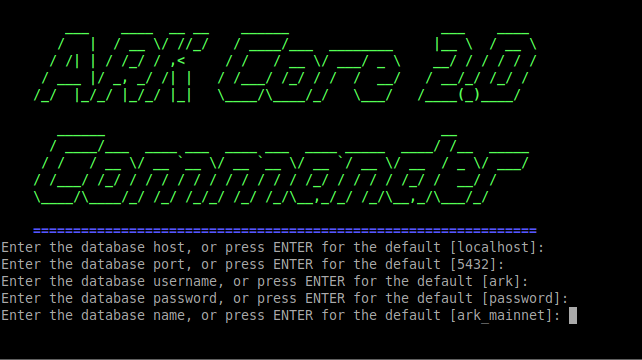
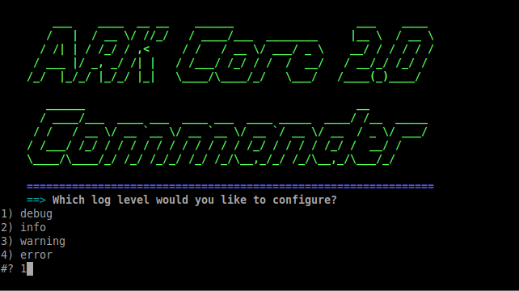

# Installing a Relay Node
Ark offers an easy to setup solution for running a relay node for v2 with [Core Commander](https://github.com/ArkEcosystem/core-commander).

The experience is similar to the old solution for v1: Ark Commander.

Core Commander only supports Ubuntu (16.04, 18.04).

## Hardware Requirements
 - 4GB RAM
 - 40GB SSD
 - 2 Cores

## Installation with our official `core-commander` console tool
On a fresh Ubuntu installation, follow these commands

1. Update and Upgrade
```sh
sudo apt-get update && sudo apt-get upgrade
```

2. Add new user and add to sudo group
```sh
sudo adduser username
sudo usermod -aG sudo username
```

3. Login to the new user account and clone Core Commander
```sh
sudo su - username
git clone https://github.com/ArkEcosystem/core-commander
```

4. Execute commander.sh with bash
```sh
bash core-commander/commander.sh
```

5. Enter your sudo password


6. Let Core Commander install software dependencies




7. Reboot your system


8. Log back in and run Core Commander with bash again
```sh
username@host:~$ bash core-commander/commander.sh
```

9. You will be told that your system is up to date


10. Choose `I`, `ENTER` to Install Ark Core on the main menu


11. Let Core Commander clone and build Ark Core


12. Choose your network version


13. Configure database settings and log level for your setup



14. Start the relay node


15. Monitor the sync progress with `R`, `ENTER`, `L`, `ENTER`


The node will sync and the messages will show you when it is ready to be used.

## Generic linux installation
If your organization policy doesn't allow to use other installation tools - meaning requirements clearly state that a standalone installation is needed, then the following scripts will help you with installation of the Ark blockchain.

::: tip
The following scripts assume that NodeJs and Postgres are already installed on your system. For minimum versions, please use NodeJs >10 and Postgres >9.5. Install them according to you operating system instructions. 
:::

### Installation script
```bash
sudo yarn global add pm2 lerna
sudo -u postgres psql -c "create user ark with password 'password';"
sudo -u postgres psql -c "create database ark_mainnet with owner 'ark';"
mkdir -p ~/.ark/config
cat > ~/.ark/.env <<EOL
ARK_LOG_LEVEL=debug
ARK_DB_HOST=localhost
ARK_DB_PORT=5432
ARK_DB_USERNAME=ark
ARK_P2P_HOST=0.0.0.0
ARK_P2P_PORT=4001
ARK_API_HOST=0.0.0.0
ARK_API_PORT=4003
ARK_WEBHOOKS_HOST=0.0.0.0
ARK_WEBHOOKS_PORT=4004
ARK_GRAPHQL_HOST=0.0.0.0
ARK_GRAPHQL_PORT=4005
ARK_JSON_RPC_HOST=0.0.0.0
ARK_JSON_RPC_PORT=8080
ARK_API_RATE_LIMIT=false
ARK_API_SSL=false
ARK_API_SSL_HOST=0.0.0.0
ARK_API_SSL_PORT=8443
ARK_API_SSL_KEY=~/.ark/ssl/ark.key
ARK_API_SSL_CERT=~/.ark/ssl/ark.crt
EOL
cd ~/
git clone https://github.com/ArkEcosystem/core.git ark-core
cp -f ~/ark-core/packages/core/lib/config/mainnet/* ~/.ark/config/
cp -f ~/ark-core/packages/crypto/lib/networks/ark/mainnet.json  ~/.ark/config/network.json
cd ark-core
lerna bootstrap
cd packages/core
pm2 --name 'ark-core-relay' start -l ~/ark-core.log --merge-logs ./bin/ark -- relay --config ~/.ark/config --network mainnet
```

### Update script
```bash
pm2 stop all
cd ark-core
git reset --hard
git pull
lerna bootstrap
rm -f ~/.ark/config/peers_backup.*
cp -f ~/ark-core/packages/core/lib/config/mainnet/* ~/.ark/config/.
cp -f /home/node/ark-core/packages/crypto/lib/networks/ark/mainnet.json /home/node/.ark/config/network.json
pm2 start all
```

## Next steps
::: warning
Please note that API will be available, when node will sync with the network. This can take up to 15h (depending on your network speed).
:::
Now that the relay node is setup you can head over to the [JSON-RPC installation guide](/exchanges/json-rpc.html) or look at relevant [Public API endpoints](/exchanges/public-api.html) related to blockchain functionality to manage your wallets and transactions. 


## Notes

Please read the documentation pages for all of our [Ark Client and Crypto libraries](/api/sdk/) (offerred in many programming languages).

Also, read the [API documentation](/api/public/v2/).
