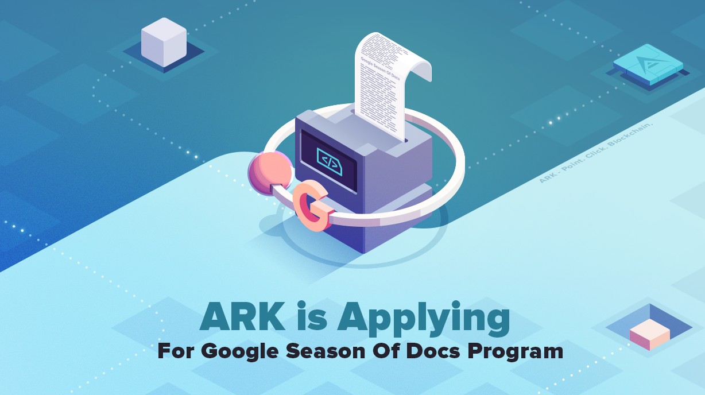

# Google Season of Docs

[[toc]]

The ARK Blockchain Platform is continuously expanding with it's modular Core design and extensive range of peripherals accompanying it. At this stage of development, we feel it would now be the appropriate time to apply for the Google Season of Docs program.
This initiative will allow aspiring technical writers to hone their skills in the art of technical writing, as well as helping to evaluate and improve our documentation. You will be able to to work tightly with the ARK Team and our large technical community. ARK has always felt a huge amount of pride with our Open Source approach and we feel that participating in Open Source programs such as GSoD is not only important for ARK, but also for the wider Open Source community.

## What is ARK?

ARK empowers everyone, regardless of their aim or technical background, to quickly and easily leverage blockchain technology. In this current landscape of hype and empty promises, ARK acts as a beacon for individuals, enterprises, and communities who wish to make a real difference and apply blockchain technology to reach their individual goals as well as improve society. ARK offers a technology stack, unique in its simplicity, to create and deploy standalone blockchains for any use case. These newly created blockchains will have the ability to interoperate through ARK SmartBridge Technology. ARK is also turning Smart Contracts on their head with what is called ARK Logic, a collection of tools including custom transaction types, templates, and plugins. This brings decentralized computing and workflows into a more secure, adaptable, and scalable environment. Most importantly, the ARK Ecosystem fosters a growing international community of developers, node operators, blockchains, businesses, and enthusiasts, breathing life into this breakthrough technology.
The ARK Team, also known as the ARK Crew, is decentralized throughout the world and has no main office. Team members come from the United States, France, Spain, Brazil, United Kingdom, Germany, The Netherlands, Slovenia, Finland, Bulgaria, Ukraine, and others. The ARK Crew is determined to change the world by giving everyone accessibility to the awesome power of blockchain. We have been expanding and hiring more talent regardless of market conditions, and we are in possession of multiple years' worth of working capital in various cryptocurrencies.

## ARK and GSoD program

Pending a successful application, ARK would like to provide a technical writer the opportunity to work on an open-source blockchain project that utilizes cutting edge technology combined with a very vibrant and active community. With various ARK Core milestones recently completed and a plethora of new technology to uncover, there is no shortage of technical documentation, for both evaluation and writing, related to our slate of products and services.
We are looking for a new technical writer, that is flexible, understands technology in terms of scope, development, has the ability to write developer tutorials supported with examples, and can also help with basic user application guides. GSoD program gives us the ability to open our doors even more and potentially find a new member of our distributed team.

## How Do We Work?

Our documentation is available on https://docs.ark.io. Everything can be found here and also on our Blog. Documentation is a central point for Exchanges, Developers, Node Operators and blockchain enthusiast in general, allowing them to find information and build solutions on top of our blockchain platform. Documentation is based on VuePress, meaning that our docs are written in markdown language, making it easy to jump on and start collaborating from everywhere.
Documentation is open-source and its source code can be found here: https://github.com/ArkEcosystem/docs/. 
Just follow the Readme.md instructions and you will have your documentation project setup in a matter of minutes. We also prepared initial guidelines on How to Start Writing Documentation for ARK.
Depending on the ability of the technical writer, we would like to provide the following projects (but are not limited to only them).

## Projects for Technical Writers

### Project 1 - Getting Started With Core Blockchain Development guide

Getting started with new technology is always a challenge and a learning curve. The first wall you hit as a developer is usually establishing a working environment. As a technical writer you can check, evaluate and improve our current getting started guide, or provide one of your own. Always have a bigger picture in mind, like the positioning of the guidelines in our overall documentation structure, adding of new content, linking existing stuff and of course be creative.

**Related materials:**

- [Developer Environment Guidebook](https://docs.ark.io/guidebook/developer/setup-dev-environment.html)
- [ARK Core GitHub Repository](https://github.com/ArkEcosystem/core)

### Project 2 - Documentation Site Overview and layout improvement

Analyze our documentation site and refactor it to provide an improved user experience (adjust layout, structure, address personas from the start, be creative). Put yourself into different roles and evaluate introduction tutorials, analyze what is missing and make notes/propose improvements.

**Related materials:**

- [VuePress Documentation Source Code](https://github.com/ArkEcosystem/docs/)

### Project 3 - ARK and IoT Tutorials

ARK, being a light and very flexible blockchain platform, targets IoT development as one of the most important parts of its technology stack. We provide tools and services to develop light application running on various boards, and by using our blockchain platform as a backend. This gives you the ability to focus on your application, while we handle the rest. We already provide a scope of IoT hardware support and the related tutorials needed to play/understand them. Your task here would be to replay and improve them, and later on add new IoT examples based on your own ideas.

**Related materials:**

- [IoT Documentation Section](https://docs.ark.io/iot/)
- [Cpp Client Source Code](https://github.com/ARKEcosystem/cpp-client)
- [Cpp Crypto Source Code](https://github.com/ARKEcosystem/cpp-crypto)

### Project 4 - A Step-By-Step Guide On Using Webhooks to listen to blockchain events

From the release of ARK Core 2.0, we included webhooks as a means for developers to subscribe to blockchain events and use this approach in their applications. As a writer, your starting point would be evaluating the current documentation part on this topic and expanding on it with a complete step-by-step guide outlining the webhooks setup and usage process supported with a simple example of your choosing.

**Related materials:**

- [WebHooks Documentation](https://docs.ark.io/guidebook/core/webhooks.html)
- [WebHooks Plugin Repository](https://github.com/ArkEcosystem/core/tree/develop/packages/core-webhooks)

### Project 5 - A Step-By-Step Guide On Building Plugins/dApps

A plugin is a very powerful concept inside our Core blockchain platform. It is used by our development team as well as our partner projects. Plugins give you the ability to develop your own applications, and deploy them on the blockchain. Plugins are a typescript/javascript application and are only limited by your imagination (starting your own http server, develop a shop, an ecommerce plugin, a new website). Your task would be to evaluate current core-plugin documentation and use it to write a custom plugin (like sending an alert, a notification, …). You would use the developed example and lessons learned during the process to develop a detailed step-by-step guide for plugin development, supported by accompanying example.

**Related materials:**

- [Plugin Documentation](https://docs.ark.io/guidebook/core/plugins/)

### Project 6 - A Step-By-Step Guide On Building Custom Transactions

In a future ARK Core release we are introducing AIP 29, codename GTI ("Generalized Transaction Interface"). GTI enables developers to introduce custom transaction types with ease. New base classes for transactions are going to be introduced. This will allow us to develop new transaction types by using skeleton designs. Making new transaction types will become easier, standardized and will give developers instant options to implement new transaction types supported with all blockchain logic (cryptography, security, validation and verification). Your task would be to familiarize yourself with the specifications and concept and develop a new custom transaction type. You will be guided and directed by our team and the final result would be a detailed step-by-step guide on how to develop custom transaction types with our blockchain platform.

**Related materials:**

- [AIP-29 Specification](https://github.com/ArkEcosystem/AIPs/blob/master/AIPS/aip-29.md)
- [Core Repository](https://github.com/ArkEcosystem/core/)

## Conclusion

These are just some of the cutting edge projects we are working on. For each of these projects, we are focused on making our documentation more user friendly and more approachable to the wider technical and developer community. Pending the result of our GSoD application, we are looking forward to working with all technical writers and technically gifted people. We promise to support and assist you getting acquainted with our technology. Together, we will work in synergy to complete the tasks agreed by both parties.
