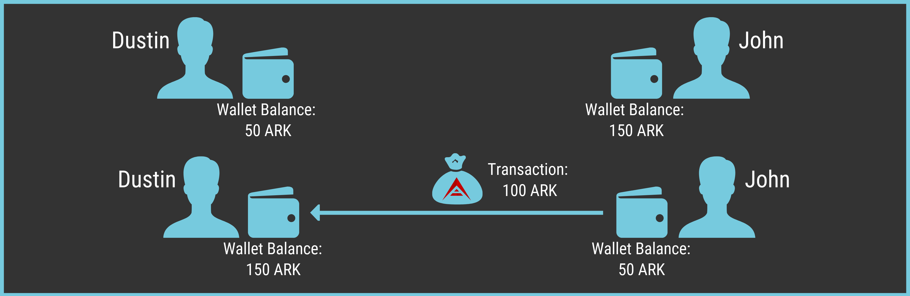

# Understanding Transactions and Block Propagation

Transactions are the smallest fundamental units of the ARK blockchain. Users create and sign transactions, transmit them to the network; where they are stored until a delegate picks up the transaction and forges a block. Afterward, the delegate will send the block back to the network, where each node validates its contents before adding it to their blockchain.

To understand these concepts better let us go over a brief explanation of transaction and blocks inside a general blockchain transaction and afterward we will go over exactly how these function within the ARK network.

A `transaction` is nothing more than the transfer of data from a sender to a receiver through the blockchain network that they are using. A basic cryptocurrency `transaction` usually includes the following information:

- Amount to be transferred.
- Ownership information: who created the transaction and who is the recipient.
- Timestamp of the transaction.
- Transaction Identification Number.

Blockchains built on top of UTXOs will also reference prior outputs (the ownership side of the transaction) to prove that the transaction is valid. Account based blockchains keep track of balances using an account based model and do not require UTXOs. [Bitcoin](https://en.bitcoin.it/wiki/Main_Page) is based on UTXOs while [Ethereum](https://en.wikipedia.org/wiki/Ethereum) uses accounts. ARK also uses an account model, but the address scheme used is actually derived from Bitcoin.

Let's look over an ARK network transaction step by step so you can see how it works.

Dustin owned 50 ARK, and yesterday John sent Dustin 100 ARK. Dustin now has a balance of 150 ARK in his wallet.

Today Dustin decided to send Cassandra her first 100 ARK. Dustin will now go into his wallet to initiate the transaction by inputting Cassandra's address, Amount of ARK to send (100) and pressing Send. When he presses **_Send_**, he will have to input his Private Key, which is like a password and confirms the transaction.

Under the hood, the web wallet will first create a data object containing the sender's address, the amount, some metadata such as the time and the recipient's address. Anyone could produce such an object, even though they would not own the wallet. For that reason, Dustin needs to prove that he is the actual owner of the wallet. This is performed using his private key, which can be used to sign the data object. [Asymmetric cryptography](https://en.wikipedia.org/wiki/Public-key_cryptography) allows the network to validate the origin of the transaction, and authorize the transfer.

Once the transaction is sent from Dustin's wallet, it is broadcast to the network, where [Relay Nodes](/introduction/ark/ark-network-topology.html#relay-nodes) will validate and pass on the transaction.

It is still in a _Pending_ state. This means that the transaction has not been included in a block of transactions, verified and included in the ARK blockchain by a "forging delegate". It could still be discarded or invalidated, for example, if Dustin were to transmit two conflicting transactions. Individually both are valid, but only one can be incorporated in the blockchain.

A node on the network will check the inputs/outputs of the transaction and verify that Dustin has the ARK necessary to send the 100 ARK plus the transaction fee (more on fees at the end of the section). Once that Node has verified Dustin's transaction as legitimate, it signals that determination to the rest of the network.

Once a `Relay Node` has transmitted the transaction to a `Delegate Node`, the transaction may be incorporated in a block. Because the transaction has a unique ID, it can only be added to the chain once.

`Delegate Nodes` are special actors in the network who combine transactions into `blocks` and verify them, committing them permanently into the ARK blockchain. Forging delegates are elected by the community through [election processes](/introduction/ark/ark-network-topology.html#voting).

This entire process takes on average eight seconds, depending on the total network load.

## Network Fees

There are multiple fundamental weaknesses in distributed ledgers. In the above scenario, Dustin could create a billion transactions, each transferring a fraction of a single ARK. This would significantly increase the size of the ARK blockchain and prevent other genuine users from transferring funds. To combat such a [Spam Attack](https://en.bitcoin.it/wiki/Spam_transactions), delegates will charge a fee for processing transactions. These fees are set dynamically, such that during low network load, transactions are very cheap, but during high loads or spam attacks, fees are increased, causing Dustin to run out of ARK quite fast.

Users may also choose to pay a fixed fee, which is mainly a remnant from ARK `v1`.
