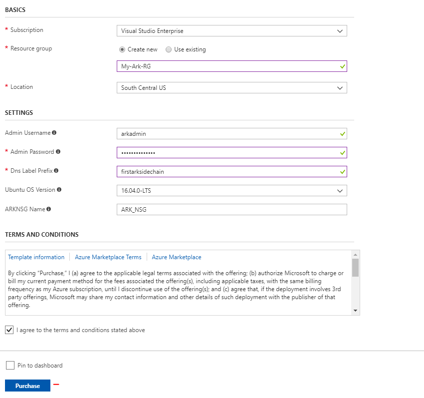
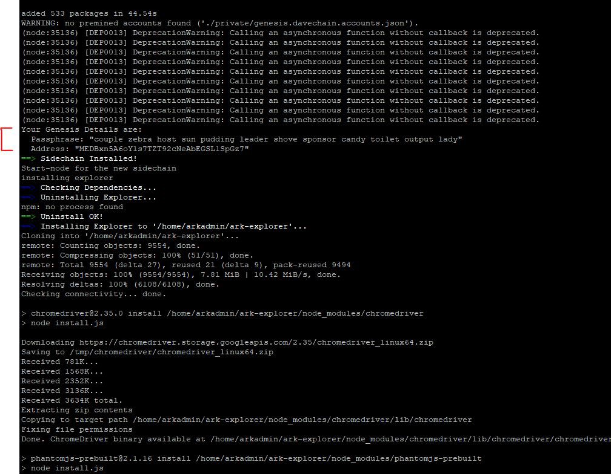
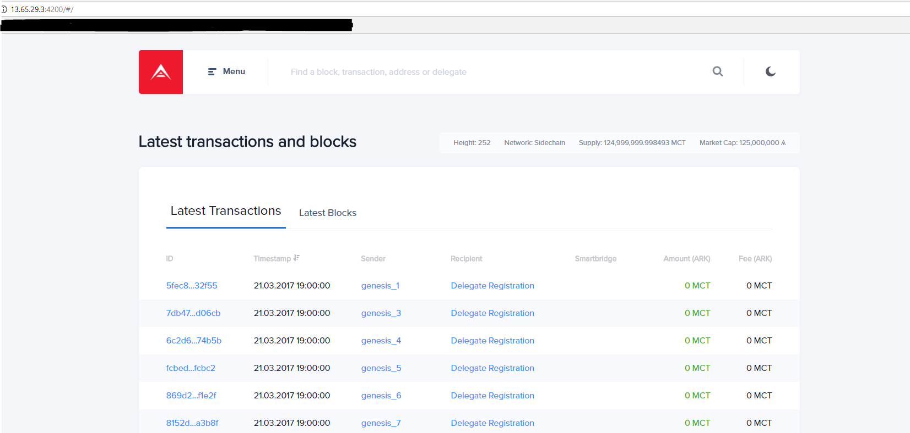

# Deployments using Microsoft Azure

Microsoft Azure offers cheap, reliable servers, virtual machines, and container services.

[[toc]]

::: tip

This deployment method can be used to jump-start your journey to your BridgeChain in the process outlined [here](/deployer/deployer.html).

:::

## Prerequisites

An active [Microsoft Azure](https://azure.microsoft.com/en-us/) account (Trial works fine) and basic knowledge on how to connect via SSH (E.g. [PuTTY](https://www.putty.org/) for Windows) and manage a remote server.

You will end up with the following:

- Ubuntu VM in Azure.
- Azure PublicIP and firewall configurations.
- Your BridgeChain node and ARK Explorer.

We will be using a setup available at our [GitHub](https://github.com/ARKEcosystem/ark-azure).

## Virtual Machine Quick Deployment

Navigate to: [https://github.com/ARKEcosystem/ark-azure](https://github.com/ARKEcosystem/ark-azure)
Click on the big blue “Deploy to Azure” button to be taken to Portal.Azure.com. Login with your account (trial or not, either will work).


You should only need to input data for three empty fields (Resource Group, Admin Password, and DNS Label), but full details for this section:

- **Subscription** : If not already on your current one.
- **Resource Group** :  `Create New` is the only option that will work unless you wish to edit the template yourself. We will use My-ARK-RG for this guide.
- **Location** :  Choose your desired region, ensuring it allows the subscription you chose above. If in doubt, use the default region when using a Free Trial.
- **Admin Username** :  This is the account you will use to sign into the server.
- **Admin Password**:  Secure string and has high complexity requirements.
- **DNS Label Prefix** : This is the unique DNS name that you are giving to this VM. It is mandatory that this name be unique in the Location Datacenter as a whole (It will self-check after input) - Remember this for easy SSH establishment.
- **Ubuntu OS Version** : Only option is 16.04-LTS at this time.
- **ARKNSG Name** :  This is the name for the firewall group to permit SSH as well as ARK Node/Explorer port access to this VM.



Currently, the VM produced is a Standard_A1 size VM. This is a very low-cost resource VM for tutorial purposes (can be scaled-up after deployment if desired or via template adjustment)

Click `Agree`, and `Purchase` to begin deployment. The entire process should take 5–10 minutes.

## Connecting to the VM + ARK Deployer

You are welcome to explore your new VM’s Overview by clicking on `Resource Groups` and finding your new group, and the VM inside. There are lots of configuration items here.

If you do not remember your Public DNS name or IP address (for SSH), go to: `Resource Groups` > `My-ARK-RG` > `MyUbuntuVM` > `Overview`. This has all the general information you will need.


## Connecting via SSH

The Public DNS Name for all VMs follows this pattern:
PublicDNSname.locationid.cloudapp.azure.com

So in this case, it would be here: `firstarksidechain.southcentralus.cloudapp.azure.com`


SSH into your new VM using the Public DNS Name and log in with the credentials used during the VM Template deployment page.


Run the following command (It’s a one-liner, copy and paste the full contents from here or from the **[ARK Azure Github page](https://github.com/ARKEcosystem/ark-azure)**)

```bash
curl -o- https://raw.githubusercontent.com/ARKEcosystem/ark-azure/master/script/arkdefaultinstall.sh | bash
```

This script will complete all of the installation steps to get both the node and explorer running for your BridgeChain, with all the default values. Total installation time is about 10 minutes.

::: warning
There is 1 essential item to locate in the stream of data being output to the console (for wallet control). Your Genesis Passphrase details!
:::

Just after the node gets installed, there will be three lines of text to record. Copy these lines outlined in red below.



This information will be used later on, as you explore ARK past the deployment phase with [ARK Deployer](https://github.com/ARKEcosystem/ark-deployer). Please copy and paste it right out of the console window for safe keeping.

## Explorer in Action


This is the Public IP of your server, and the port required to view the ARK Explorer for your BridgeChain (4200). The API should be available on port 4100.

You can highlight the URL straight from the SSH window, such as http://13.65.29.3:4200 and hit CTRL+C to copy it. Paste into a browser, and voila!



## Customizing Your Deployment

If you wish to customize your deployment of ARK within the bounds of ARK Deployer, download a copy of the [Azure Shell script](https://raw.githubusercontent.com/ARKEcosystem/ark-azure/master/script/arkdefaultinstall.sh).


Within this file, you’re welcome to edit the list of variables on lines 21–31 and personalize them. These variables all align with an optional parameter of ARK Deployer (See GitHub: [optional parameters](https://github.com/ARKEcosystem/ark-deployer#optional-parameters))

You can then run this new version of your script against a new VM, or, you can uninstall the original node/explorer and re-install using the script again. We would recommend just rolling out a new server for ease of use, but that’s your call.

## Personalize the Script

- Navigate to: [https://raw.githubusercontent.com/ARKEcosystem/ark-azure/master/script/arkdefaultinstall.sh](https://raw.githubusercontent.com/ARKEcosystem/ark-azure/master/script/arkdefaultinstall.sh).
- Copy the contents of this file.
- Open a new tab to [https://gist.github.com/](https://gist.github.com/).
- Paste the contents of the clipboard to this file, and customize lines 21–31 to your heart's content. These variables all align with an optional parameter of ARK Deployer (See GitHub: [https://github.com/ARKEcosystem/ark-deployer#optional-parameters](https://github.com/ARKEcosystem/ark-deployer#optional-parameters)).
- Create a ‘Public Gist’ with a .sh file name, or host the raw text somewhere else. It must be publicly accessible for this tutorial to work.


Click on “Raw” on the same line as your file name and copy the URL.

On the VM, run the following to execute the new deployment.

```bash
curl -o- paste-raw-gist-URL-here-ending-in.sh | bash
```

## Special Mention

Special thanks to [Walrusface](https://medium.com/@walrusface) for writing the original guide and script, Delegate [Jarunik](https://medium.com/@jarunik) for sponsoring its development and our developer [Alex Barnsley](https://medium.com/@alexbarnsley) for testing and modifying necessary things in ARK deployer.
c
