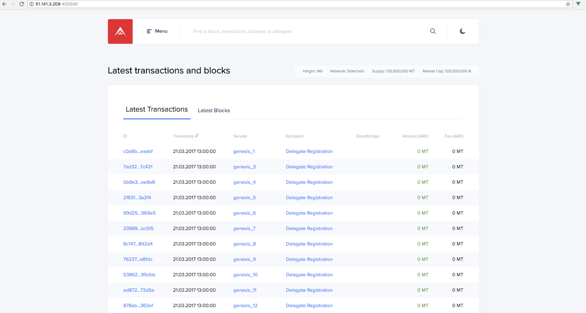
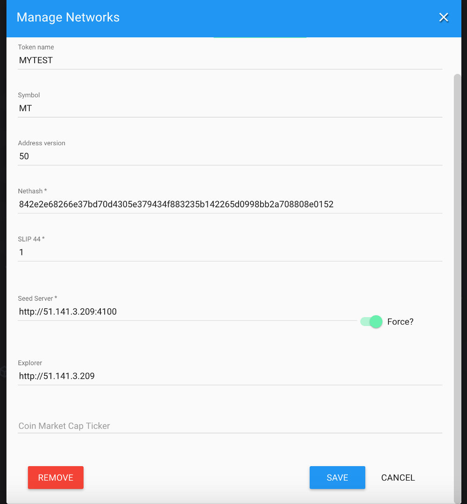
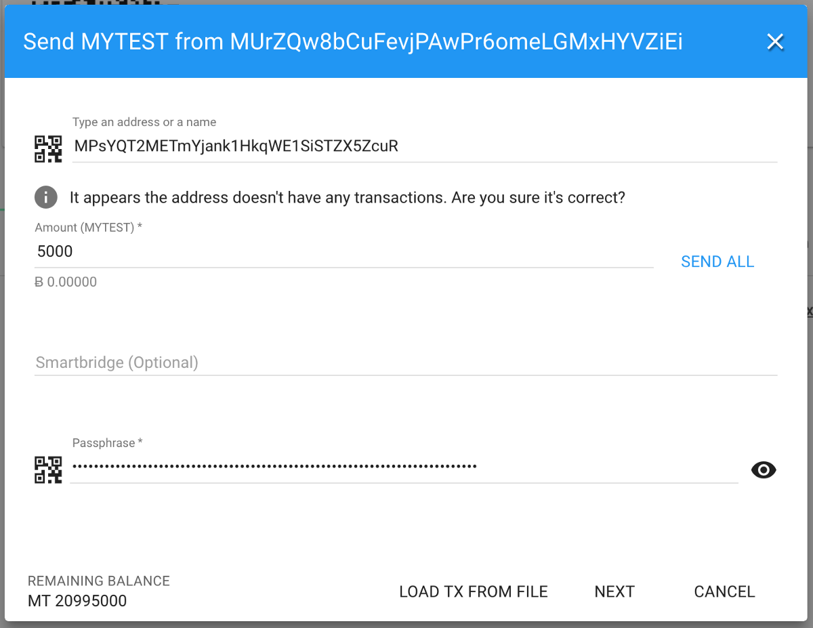

# Configuring GUI Services

## Setting up your BridgeChain Explorer

The explorer is used to view information on your BridgeChain. It provides details about the delegates that are active and on standby. It also provides information about all the addresses, transactions and blocks that are available. In summary, everything you need to know about your BridgeChain can be found in the explorer.

Install the explorer by running:

```bash
./bridgechain.sh install-explorer --name MyTest --token MYTEST --node-ip 51.141.3.209 --explorer-ip 51.141.3.209 --skip-deps
```

And run the explorer in the background:

```bash
./bridgechain.sh start-explorer
```

Or run the explorer in the foreground:

```bash
cd ~/ark-explorer
npm run bridgechain
```

```bash
$ ./bridgechain.sh start-explorer

===> Stopping...
npm: no process found
===> Stop OK!
===> Starting explorer
...
...
DONE Compiled successfully in 19555ms
Your application is running here: http://10.0.04:4200
```



Once the explorer is running, you can give it a test by navigating to it through your browser.


## Adding the BridgeChain to your Desktop Wallet

Having a BridgeChain is great, but you'll probably to interact with it and send out some of your genesis tokens. This will be required when forging with new delegate nodes (instead of auto-forging).


From your desktop wallet, go to Settings (the gear icon at the top-right) and choose “Manage Networks”.


Go to the `New` tab, enter your network name, input the URL of your BridgeChain node (including `http://`, leaving the trailing slash off the end), and then enable “Force”. The Force option means the desktop wallet will always connect to this peer when dealing with the Network, and won’t deal with any other peers. Once done, click on the `Create` button.



You are then presented with all the details for your Network. Click on the `Save` button here.


From the Networks (Wi-Fi Icon at the top-right), change to your newly created Network.


Now import your genesis passhprase which you was given when installing your node and click `Import`.


You will notice your wallet now has the pre-mined tokens already there and available. You can send those tokens to a new wallet straight away.



Generate a new wallet, and send some tokens from your genesis wallet.


You will notice the genesis wallet is no longer a cold wallet (a cold wallet has no public key), and our transaction was sent correctly.


## Adding a Forging Delegate to the Network

Using the desktop wallet and our new address that we just set up, we will register as a delegate and set up a new node so we are forging external to our seed node. This section requires some command-line experience.

### Register a Delegate


To register a new Delegate through the wallet, click on the Menu Icon (3 vertical dots at the top-right).


Then choose the “Register Delegate” option.


Enter your desired name, and input your passphrase. You can then submit that transaction to the network.


Reload your desktop wallet and you will see your wallet is now a delegate.

### Voting for your new Delegate

Because we’re in an auto-forging state, we don’t need to vote for ourselves. However, once no genesis delegates remain, votes are required to become a Delegate.


In the new Delegate Wallet, go to the Votes tab and click on the “Vote” button.


Find yourself in the delegate list and enter your passphrase. You can then press “Next” and send the transaction.


You will then see information about yourself in the Votes tab.


You will also see your Delegate showing in the Explorer Delegate Monitor.

### Summary

To conclude, we have just set up our first forging delegate node. This means we can start adding more nodes to the network, and gradually move away from the auto-forging setup that we have. Due to the performance of the machines we used in this case, it is very possible for the delegate node to stop syncing, or to struggle to keep up-to-date. In reality, the network needs a lot of relay nodes to ensure other nodes can continue to receive blocks. The reliability of the network increases with the total number of nodes.

### Your Next Steps

1. Move all pre-mined tokens into a new wallet of which only you know the passphrase for (or use a Ledger hardware wallet inside the Desktop Wallet).
2. Commit the new config and genesis files, and put them in a forked GitHub Repository.
3. Add more relay nodes to the network just as we just have (skipping the delegate step).
4. Consolidate all relay node IP & ports.
5. Move all delegate forging nodes to their own machines.