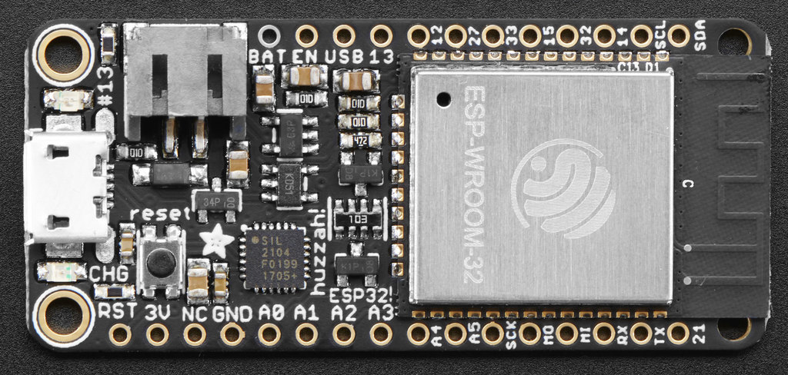
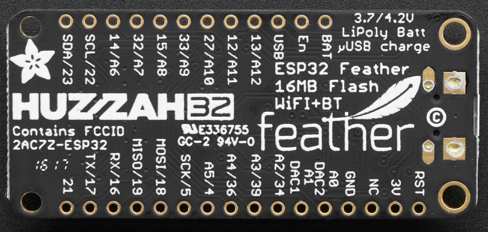
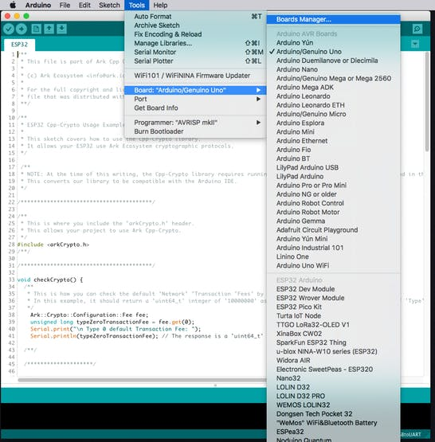
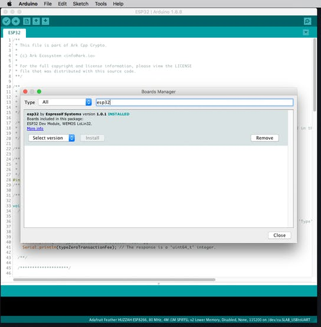
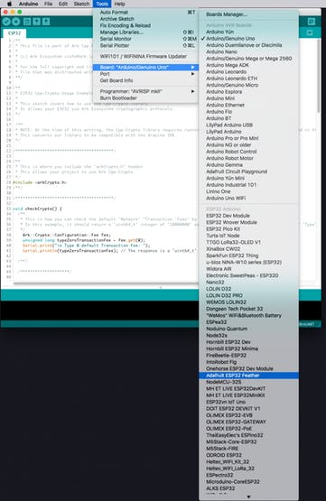

# Adafruit ESP32 Feather



[[toc]]

## Features

<details>
<summary>
  <h4>These are the SDK features that are currently available on the Adafruit ESP32 Feather board</h4>
</summary>
<p>

**Cpp-Client:**
| Feature: | Supported:**[ ]**|
| :------: | :----: |

**API:**
| **Blocks:** |**[x]**|
| :----- | :---: |
| • `get(const char* const blockId)` |**[x]**|
| • `all(int limit, int page)` |**[x]**|
| • `transactions(const char* const blockId)` |**[x]**|
| • `search(const std::map<std::string, std::string>& bodyParameters, int limit, int page)` |**[x]**|

| **Delegates:** |**[x]**|
| :----- | :---: |
| • `get(const char *const identifier)` |**[x]**|
| • `all(int limit, int page)` |**[x]**|
| • `blocks(const char *const identifier, int limit, int page)` |**[x]**|
| • `voters(const char *const identifier, int limit, int page)` |**[x]**|

| **Node:** |**[x]**|
| :----- | :---: |
| • `configuration()` |**[x]**|
| • `status()` |**[x]**|
| • `syncing()` |**[x]**|

| **Peers:** |**[x]**|
| :----- | :---: |
| • `get(const char* const ip)` |**[x]**|
| • `all(int limit, int page)` |**[x]**|

| **Transactions** |**[x]**|
| :----- | :---: |
| • `getUnconfirmed(const char* const identifier)` |**[x]**|
| • `get(const char* const identifier)` |**[x]**|
| • `all(int limit, int page)` |**[x]**|
| • `allUnconfirmed(int limit, int page)` |**[x]**|
| • `types()` |**[x]**|
| • `search(const std::map<std::string, std::string>& body_parameters, int limit, int page)` |**[x]**|

| **Votes** |**[x]**|
| :----- | :---: |
| • `get(const char* const identifier)` |**[x]**|
| • `all(int limit, int page)` |**[x]**|

| **Wallets** |**[x]**|
| :----- | :---: |
| • `get(const char *const identifier)` |**[x]**|
| • `all(int limit, int page)` |**[x]**|
| • `top(int limit, int page)` |**[x]**|
| • `transactions(const char *const identifier, int limit, int page)` |**[x]**|
| • `transactionsReceived(const char *const identifier, int limit, int page)` |**[x]**|
| • `transactionsSent(const char *const identifier, int limit, int page)` |**[x]**|
| • `votes(const char *const identifier, int limit, int page)` |**[x]**|
| • `search(const std::map<std::string, std::string> &bodyParameters, int limit, int page)` |**[x]**|

---

**Cpp-Crypto:**
| Feature: | Supported:**[ ]**|
| :------: | :----: |

**Configuration:**
| **Fee:** |**[x]**|
| :----- | :---: |
| • `get(int type)` |**[x]**|
| • `set(int type, uint64_t fee)` |**[x]**|

| **Network:** |**[x]**|
| :----- | :---: |
| • `get()` |**[x]**|
| • `set(const AbstractNetwork& network)` |**[x]**|

**Enums:**
| **Fees:** |**[x]**|
| :----- | :---: |

| **Types:** |**[x]**|
| :----- | :---: |

**Identities:**
| **Address:** |**[x]**|
| :----- | :---: |
| • `toBytes()` |**[x]**|
| • `toString()` |**[x]**|
| • `fromPassphrase(const char *const passphrase, uint8_t networkVersion)` |**[x]**|
| • `fromPrivateKey(PrivateKey privateKey, uint8_t networkVersion)` |**[x]**|
| • `fromPublicKey(PublicKey publicKey, uint8_t networkVersion)` |**[x]**|
| • `validate(Address address, uint8_t networkVersion)` |**[x]**|
| • `validate(const char *const addressStr, uint8_t networkVersion)` |**[x]**|
| • `validate(const uint8_t *addressBytes, uint8_t networkVersion)` |**[x]**|
| • `base58encode(const uint8_t *source)` |**[x]**|
| • `bytesFromBase58Check(const char *const address)` |**[x]**|

| **Mnemonic:** |**[x]**|
| :----- | :---: |
| • `generate(size_t num_words = 12u, Language language)` |**[x]**|

| **PrivateKey:** |**[x]**|
| :----- | :---: |
| • `toBytes()` |**[x]**|
| • `toString()` |**[x]**|
| • `fromPassphrase(const char *const passphrase)` |**[x]**|
| • `fromHex(const char *const privateKey)` |**[x]**|
| • `fromWIFString(const char *wifStr, uint8_t wifByte)` |**[x]**|
| • `validate(PrivateKey privateKey)` |**[x]**|
| • `validate(const char *privateKeyStr)` |**[x]**|
| • `validate(const uint8_t *privateKeyBytes)` |**[x]**|

| **PublicKey:** |**[x]**|
| :----- | :---: |
| • `toBytes()` |**[x]**|
| • `toString()` |**[x]**|
| • `isValid()` |**[x]**|
| • `fromPassphrase(const char *const passphrase)` |**[x]**|
| • `fromHex(const char *const publicKey)` |**[x]**|
| • `fromPrivateKey(PrivateKey privateKey)` |**[x]**|
| • `validate(PublicKey publicKey)` |**[x]**|
| • `validate(const char *publicKeyStr)` |**[x]**|
| • `validate(const uint8_t *publicKeyBytes)` |**[x]**|

| **WIF:** |**[x]**|
| :----- | :---: |
| • `toBytes()` |**[x]**|
| • `toString()` |**[x]**|
| • `fromPassphrase(const char *const passphrase, uint8_t wifByte)` |**[x]**|


**Transactions:**
| **builder:** |**[x]**|
| :----- | :---: |
| • `buildTransfer(std::string recipientId, uint64_t amount, std::string vendorField, std::string passphrase std::string secondPassphrase = "")` |**[x]**|
| • `buildSecondSignatureRegistration(std::string passphrase, std::string secondPassphrase = "")` |**[x]**|
| • `buildDelegateRegistration(std::string username, std::string passphrase, std::string secondPassphrase = "")` |**[x]**|
| • `buildVote(std::vector<std::string> votes, std::string passphrase, std::string secondPassphrase = "")` |**[x]**|
| • `buildMultiSignatureRegistration(uint8_t min, uint8_t lifetime, std::vector<std::string> keysgroup, std::string passphrase, std::string secondPassphrase = "")` |**[x]**|

| **Deserializer:** |**[x]**|
| :----- | :---: |
| • `deserialize()` |**[x]**|

| **Serializer:** |**[x]**|
| :----- | :---: |
| • `serialize()` |**[x]**|

| **Transaction:** |**[x]**|
| :----- | :---: |
| • `getId()` |**[x]**|
| • `sign(const char* passphrase)` |**[x]**|
| • `secondSign(const char* passphrase)` |**[x]**|
| • `verify()` |**[x]**|
| • `secondVerify(const char* secondPublicKey)` |**[x]**|
| • `toBytes(bool skipSignature = true, bool skipSecondSignature = true)` |**[x]**|

**Utils:**
| **Message:** |**[x]**|
| :----- | :---: |
| • `sign(std::string newMessage, const char *const passphrase)` |**[x]**|
| • `verify()` |**[x]**|
| • `toArray()` |**[x]**|
| • `toJson()` |**[x]**|
| • `toString()` |**[x]**|

| **slot:** |**[x]**|
| :----- | :---: |
| • `time(Crypto::Networks::AbstractNetwork network)` |**[x]**|
| • `epoch(Crypto::Networks::AbstractNetwork network)` |**[x]**|

</p>
</details>

---

## Specs

<details>
<summary>
  <h4>These are the specifications for the Adafruit ESP32 Feather board</h4>
</summary>
<p>

> The HUZZAH32 is our ESP32-based Feather, made with the official WROOM32 module. We packed everything you love about Feathers: built in USB-to-Serial converter, automatic bootloader reset, Lithium Ion/Polymer charger, and just about all of the GPIOs brought out so you can use it with any of our Feather Wings.
>
> That module nestled in at the end of this Feather contains a dual-core ESP32 chip, 4 MB of SPI Flash, tuned antenna, and all the passives you need to take advantage of this powerful new processor. The ESP32 has both WiFi and Bluetooth Classic/LE support. That means it's perfect for just about any wireless or Internet-connected project.
>
>The ESP32 is a perfect upgrade from the ESP8266 that has been so popular. In comparison, the ESP32 has way more GPIO, plenty of analog inputs, two analog outputs, multiple extra peripherals (like a spare UART), two cores so you don't have to yield to the WiFi manager, much higher-speed processor, etc. etc! We think that as the ESP32 gets traction, we'll see more people move to this chip exclusively, as it is so full-featured.
>
> ~ [Adafruit.com](https://www.adafruit.com/product/3405)

- 240 MHz dual core Tensilica LX6 microcontroller with 600 DMIPS
- Integrated 520 KB SRAM
- Integrated 802.11b/g/n HT40 Wi-Fi transceiver, baseband, stack and LWIP
- Integrated dual mode Bluetooth (classic and BLE)
- 4 MByte flash include in the WROOM32 module
- On-board PCB antenna
- Ultra-low noise analog amplifier
- Hall sensor
- 10x capacitive touch interface
- 32 kHz crystal oscillator
- 3 x UARTs (only two are configured by default in the Feather Arduino IDE support, one UART is used for 
  bootloading/debug)
- 3 x SPI (only one is configured by default in the Feather Arduino IDE support)
- 2 x I2C (only one is configured by default in the Feather Arduino IDE support)
- 12 x ADC input channels
- 2 x I2S Audio
- 2 x DAC
- PWM/timer input/output available on every GPIO pin
- OpenOCD debug interface with 32 kB TRAX buffer
- SDIO master/slave 50 MHz
- SD-card interface support

**Pinout:**



**top row:**
- BAT - this is the positive voltage to/from the JST jack for the optional Lipoly battery
- EN - this is the 3.3V regulator's enable pin. 
  > It's pulled up, so connect to ground to disable the 3.3V regulator
- USB - this is the positive voltage to/from the micro USB jack if connected  
- 13/A12 - This is GPIO #13 / analog input A12
  > also connected to the red LED next to the USB port
- 12/A11 - This is GPIO #12  / analog input A11
  > This pin has a pull-down resistor built into it,  
    we recommend using it as an output only,  
    or making sure that the pull-down is not affected during boot.
- 27/A10 - This is GPIO #27  / analog input A10
- 33/A9 - This is GPIO #33 / analog input A9
  > it can also be used to connect a 32 KHz crystal.
- 15/A8 - This is GPIO #15 / analog input A8
- 32/A7 - This is GPIO #32 / analog input A7
  > It can also be used to connect a 32 KHz crystal.
- 14/A6 - This is GPIO #14 / analog input A6
- SCL/22 - Serial Clock Line / GPIO #22
- SDA/23 - Serial Data Line / GPIO #23
    > *note that the I2C pins do not have pullup resistors already!  
    > You must add them if you want to communicate with an I2C device  

**bottom row:**
- RST - this is the reset pin for the ESP8266, 
  > - pulled high by default. 
  > When pulled down to ground momentarily it will reset the ESP32 system. 
    This pin is 3.3V logic only
- 3V - this is the output from the 3.3V regulator. 
  > The regulator can supply 500mA peak but half of that is drawn by the ESP32, 
    and it's a fairly power-hungry chip. So if you need a ton of power for stuff like LEDs, 
    motors, etc. Use the USB or BAT pins, and an additional regulator
- NC - No Connection
- GND - this is the common ground for all power and logic
- A0/26 - this is an analog input A0 / GPIO #26
  - also analog output DAC2. 
- A1/25 - this is an analog input A1 / GPIO #25
  - also analog output DAC1. 
- A2/34 - this is an analog input A2 / GPIO #34
  > note it is not an output-capable pin!
- A3/39 - this is an analog input A3 GPIO #39
  > note it is not an output-capable pin!
- A4/36 - this is an analog input A4 / GPIO #36
  > note it is not an output-capable pin!
- A5/4 - this is an analog input A5 / GPIO #4
- SCK/5 - System Clock
- MOSI/18 - Master Out / Slave In
- MISO/19 - Master In / Slave Out
- RX/16 - this is the input into the module. 
  > both are 3.3V logic
- TX/17 - this is the output from the module
- 21 - General purpose IO pin #21
- https://www.adafruit.com/product/3405

> The ESP32 is a perfect upgrade from the ESP8266 that has been so popular. In comparison, the ESP32 has way more GPIO, plenty of analog inputs, two analog outputs, multiple extra peripherals (like a spare UART), two cores so you don't have to yield to the WiFi manager, much higher-speed processor, etc. etc! We think that as the ESP32 gets traction, we'll see more people move to this chip exclusively, as it is so full-featured.
<br>src: adafruit.com

**External Resources:**

- **Adafruit Feather Huzzah ESP8266: Overview:**
    > https://learn.adafruit.com/adafruit-feather-huzzah-esp8266/overview
- **Espressif ESP32 Overvie:w**
    > http://espressif.com/en/products/hardware/esp32/overview
- **Espressif: ESP32 Datasheet:**
    > https://espressif.com/sites/default/files/documentation/esp32_datasheet_en.pdf
- **Espressif: ESP32 Technical Sheet:**
    > http://espressif.com/sites/default/files/documentation/esp32_technical_reference_manual_en.pdf

**Troubleshooting:**

- **ESP8266/32: Crashing:**
    > http://arduino-esp8266.readthedocs.io/en/latest/faq/a02-my-esp-crashes.html#introduction
- **ESP8266/32: Exception Causes:**
    > https://github.com/esp8266/Arduino/blob/master/doc/exception_causes.rst

</p>
</details>

---

## Setup

<details>
<summary>
  <h4>These are the steps to setup your Adafruit ESP32 Feather board</h4>
</summary>
<p>

**Add ESP32 to the Arduino IDE:**

Additional Boards Manager URL's
To add ESP32 to the Arduino IDE, use _**'Additional Boards Manager URL's'**_ in 'Preferences';  
this is a line separated list of hardware configuration JSON configs.

> **Preferences** >> **Additional Boards Manager URL's**

Add this line to the URL's list:  
> `https://dl.espressif.com/dl/package_esp32_index.json`


---

**Download the ESP32 packages via Board Manager:**

Open the Boards Manager from the _**Tools**_ dropdown menu:
> **Tools** >> **Board** >> **Boards Manager**

Search for and install the '**ESP32**' package in _**Boards Manager**_.




---

**Select your Board:**

From the _**Tools**_ dropdown menu:
> **Tools** >> **Board**

Select the Adafruit ESP32 Feather board



---

Install the USB driver:

For your system to talk to the ESP32 via USB, you will also need to install the _**SiLabs CP2104 Driver**_.

1) You can download the zip file for your operating system from the following website:
    - https://www.silabs.com/products/development-tools/software/usb-to-uart-bridge-vcp-drivers
    > _e.g._
    > -  _Linux_3.x.x_4.x.x_VCP_Driver_Source.zip_
    > - _Mac_OSX_VCP_Driver.zip_
    > - _CP210x_VCP_Windows.zip_ 
2) Unzip the downloaded file and run the installation package inside the unzipped folder.

<details>
<summary>
  <h4>The following pictures are of the CP2104 USB Driver installation process for macOS systems</h4>
</summary>
<p>


</p>
</details>

</p>
</details>

---

## Client Example: Arduino Sketch

<details>
<summary>
  <h4>ESP32.ino</h4>
</summary>
<p>

```cpp
/**
 * This file is part of Ark Cpp Client.
 *
 * (c) Ark Ecosystem <info@ark.io>
 *
 * For the full copyright and license information, please view the LICENSE
 * file that was distributed with this source code.
 **/
 
/**
 * This sketch covers how to use the Cpp-Client API.
 * It allows your ESP32 to send requests to an Ark Node
 */

 /**
 * NOTE: At the time of this writing, the Cpp-Client library requires running the 'ARDUINO_IDE.sh' bash script located in the 'extras' folder.
 * This converts our library to be compatible with the Arduino IDE.
 */

/****************************************/

/**
 * This is where you include the 'arkClient.h' header.
 * This allows your project to use Ark Cpp-Client.
 */
#include <arkClient.h>
/**/

/****************************************/

/**
 * This is where you include WiFi header for your board.
 * This example is for the ESP32, and includes the 'WiFi.h' header.
 */
#include <WiFi.h>
/**/

/****************************************/

/* This is the WiFi network you'd like your board to connect to. */
const char* ssid = "yourSSID";
const char* password = "yourWiFiPassword";
/**/

/****************************************/

/** 
 *  This is the IP address of an Ark Node
 *  Specifically, this is a Devnet V2 Node IP
 *  You can find more peers here: https://github.com/ArkEcosystem/peers
 *  
 *  The Public API port for the V2 Ark network is '4003'
 */
const char* peer = "167.114.29.55";
int port = 4003;
/**/

/****************************************/

/**
 * This is how you define a connection while speficying the API class as a 'template argument'
 * You instantiate a connection by passing a IP address as a 'c_string', and the port as an 'int'.
 */
Ark::Client::Connection<Ark::Client::Api> connection(peer, port);
/**/

/****************************************/

void checkAPI() {
  /**
   * This is how you can check the Version of the API
   * In this example, it should return '2' as an 'int' for V2 of Arks' API. 
   */
  auto apiVersion = connection.api.version();
    Serial.print("\nAPI Version: ");
    Serial.println(apiVersion);
  /**/

  /********************/

  /**
   * Here you can call a list of 'All' 'Blocks' on the network.
   * The '2' and '1' refer to the pagination (e.g. response limit and how many pages)
   *  
   * This is equivalant to calling '167.114.29.49:4003/api/v2/blocks?limit=2&page=1'
   * 
   * The response should be a json-formatted object
   * The "pretty print" version would look something like this
   * 
   * {
   *  "meta": {
   *    "count": 2,
   *    "pageCount": 597291,
   *    "totalCount": 1194581,
   *    "next": "\/api\/v2\/blocks?limit=2&page=2",
   *    "previous": null,
   *    "self": "\/api\/v2\/blocks?limit=2&page=1",
   *    "first": "\/api\/v2\/blocks?limit=2&page=1",
   *    "last": "\/api\/v2\/blocks?limit=2&page=597291"
   *    },
   *  "data": [
   *    {
   *      "id": "9809002764916365223",
   *      "version": 0,
   *      "height": 1178071,
   *      "previous": "10476150126412446830",
   *      "forged": {
   *        "reward": 200000000,
   *        "fee": 0,
   *        "total": 200000000,
   *        "amount": 0
   *      },
   *      "payload": {
   *        "hash": "e3b0c44298fc1c149afbf4c8996fb92427ae41e4649b934ca495991b7852b855",
   *        "length": 0
   *      },
   *      "generator": {
   *        "username": "darkcrow",
   *        "address": "DFSUsSmcVUhVZYQ1nowciWmmtnj1kvZK5Z",
   *        "publicKey": "03a8ff0a3cbdcb3bfbdb84dbf83226f338ba1452047ac5b8228a1513f7f1de80de"
   *      },
   *      "signature": "304402207fd861e98aa5e4ea0c4a828ad9104bb636b429bc73dc0d5bfe3515347e8b1a79022051f8fb3b3752f1204e8c425d0528203942756811d669c7dd1ccb15ff7bc14e09",
   *      "transactions": 0,
   *      "timestamp": {
   *        "epoch": 57144626,
   *        "unix": 1547245826,
   *        "human": "2019-01-11T22:30:26.000Z"
   *       }
   *      },
   *    {
   *      "id": "10476150126412446830",
   *      "version": 0,
   *      "height": 1178070,
   *      "previous": "1656548224477584335",
   *      "forged": {
   *        "reward": 200000000,
   *        "fee": 0,
   *        "total": 200000000,
   *        "amount": 0
   *      },
   *      "payload": {
   *        "hash": "e3b0c44298fc1c149afbf4c8996fb92427ae41e4649b934ca495991b7852b855",
   *        "length": 0
   *      },
   *      "generator": {
   *        "username": "genesis_16",
   *        "address": "DHg1jYVS23D6GP7RuhckuJsYAr6crH6c3Z",
   *        "publicKey": "03c57b6a3eb7d01ade51f95c8ae4e8ebeb7ca7b8422ab0fb2a236de5d1a5bc6a1b"
   *      },
   *      "signature": "304402201e548ee45d835a7edda9cddbe26530563c1aceebbb25ebf89966eed8fec5d0e40220140aee033d42562b22c73f097249e9a59cef24a2a7e1c887c7a16691445c2987",
   *      "transactions": 0,
   *      "timestamp": {
   *        "epoch": 57144618,
   *        "unix": 1547245818,
   *        "human": "2019-01-11T22:30:18.000Z"
   *      }
   *    }
   *  ]
   * }
   * 
   */
  const auto blocksResponse = connection.api.blocks.all(2, 1);
    Serial.print("\nBlocks Response: ");
    Serial.println(blocksResponse.c_str()); // The response is a 'std::string', to Print on Arduino, we need the c_string type.
  /**/

  /********************/

  /**
   * The following method can be used to search for a speficit Delegate.
   * In this case, 'boldninja'.
   * 
   * This is equivalant to calling '167.114.29.49:4003/api/v2/delegates/boldninja'
   * 
   * The response should be a json-formatted object
   * The "pretty print" version would look something like this:
   * 
   * {
   *  "data": {
   *    "username": "boldninja",
   *    "address": "DKrACQw7ytoU2gjppy3qKeE2dQhZjfXYqu",
   *    "publicKey": "023ee98f453661a1cb765fd60df95b4efb1e110660ffb88ae31c2368a70f1f7359",
   *    "votes": 4970515580299,
   *    "rank": 27,
   *    "blocks": {
   *      "produced": 23867,
   *      "missed": 439,
   *      "last": {
   *        "id": "13492733628654518284",
   *        "height": 1178126,
   *        "timestamp": {
   *          "epoch": 57145090,
   *          "unix": 1547246290,
   *          "human": "2019-01-11T22:38:10.000Z"
   *        }
   *      }
   *    },
   *    "production": {
   *      "approval": 0.04,
   *      "productivity": 98.19
   *    },
   *    "forged": {
   *      "fees": 103507430299,
   *      "rewards": 4731200000000,
   *      "total": 4834707430299
   *    }
   *  }
   * }
   */
  const auto delegateResponse = connection.api.delegates.get("boldninja");
    Serial.print("\nDelegate Response: ");
    Serial.println(delegateResponse.c_str()); // The response is a 'std::string', to Print on Arduino, we need the c_string type.
  /**/

  /********************/

  /**
   * The following method can be used to get the Status of a Node.
   * 
   * This is equivalant to calling '167.114.29.49:4003/api/v2/node/status'
   * 
   * The response should be a json-formatted object
   * The "pretty print" version would look something like this:
   * 
   * {
   *  "data": {
   *    "synced": true,
   *    "now": 1178395,
   *    "blocksCount": 0
   *   }
   * }
   */
  const auto nodeStatus = connection.api.node.status();
    Serial.print("\nNode Status: ");
    Serial.println(nodeStatus.c_str()); // The response is a 'std::string', to Print on Arduino, we need the c_string type.
  /**/

  /********************/

  /**
   * The following method can be used to get a list of 'All' 'Peers' on the network.
   * 
   * The '2' and '1' refer to the pagination (e.g. response limit and how many pages)
   * 
   * This is equivalant to calling 'http://167.114.29.49:4003/api/v2/peers?limit=2&page=1'
   * 
   * The response should be a json-formatted object
   * The "pretty print" version would look something like this:
   *
   * {
   *  "meta": {
   *    "count": 2,
   *    "pageCount": 46,
   *    "totalCount": 91,
   *    "next": "\/api\/v2\/peers?limit=2&page=2",
   *    "previous": null,
   *    "self": "\/api\/v2\/peers?limit=2&page=1",
   *    "first": "\/api\/v2\/peers?limit=2&page=1",
   *    "last": "\/api\/v2\/peers?limit=2&page=46"
   *  },
   *  "data": [
   *    {
   *      "ip": "213.32.9.98",
   *      "port": 4002,
   *      "version": "2.1.0",
   *      "height": 1178420,
   *      "status": 200,
   *      "os": "linux",
   *      "latency": 15,
   *      "hashid": "1c254aa0"
   *    },
   *    {
   *      "ip": "137.74.237.196",
   *      "port": 4002,
   *      "version": "2.1.0",
   *      "height": 1178420,
   *      "status": 200,
   *      "os": "linux",
   *      "latency": 20,
   *      "hashid": "64e290cc"
   *    }
   *  ]
   * }
   */
  const auto allPeers = connection.api.peers.all(2, 1);
    Serial.print("\nAll Peers: ");
    Serial.println(allPeers.c_str()); // The response is a 'std::string', to Print on Arduino, we need the c_string type.
  /**/

  /********************/

  /**
   * The following method can be used to get a list of 'Transaction' 'Types'.
   * 
   * This is equivalant to calling 'http://167.114.29.49:4003/api/v2/transactions/types'
   * 
   * The response should be a json-formatted object
   * The "pretty print" version would look something like this:
   *
   * {
   *  "data": {
   *    "Transfer": 0,
   *    "SecondSignature": 1,
   *    "DelegateRegistration": 2,
   *    "Vote": 3,
   *    "MultiSignature": 4,
   *    "Ipfs": 5,
   *    "TimelockTransfer": 6,
   *    "MultiPayment": 7,
   *    "DelegateResignation": 8
   *  }
   * }
   */
  const auto transactionTypes = connection.api.transactions.types();
    Serial.print("\nTransaction Types: ");
    Serial.println(transactionTypes.c_str()); // The response is a 'std::string', to Print on Arduino, we need the c_string type.
  /**/

  /********************/

  /**
   * This method can be used to get a list of 'Vote' Transactions.
   * The '2' and '1' refer to the pagination (e.g. response limit and how many pages)
   * 
   * This is equivalant to calling 'http://167.114.29.49:4003/api/v2/votes?limit=2&page=1'
   * 
   * The response should be a json-formatted object
   * The "pretty print" version would look something like this:
   *
   * {
   *  "meta": {
   *    "count": 2,
   *    "pageCount": 6962,
   *    "totalCount": 13924,
   *     "next": "\/api\/v2\/votes?limit=2&page=2",
   *     "previous": null,
   *     "self": "\/api\/v2\/votes?limit=2&page=1",
   *     "first": "\/api\/v2\/votes?limit=2&page=1",
   *     "last": "\/api\/v2\/votes?limit=2&page=6962"
   *  },
   *  "data": [
   *    {
   *      "id": "315481aa6f8023beb5e0e89ab2b35f11e2fda3f3f34003e6ff563517fe497e0b",
   *      "blockId": "8426118737032066166",
   *      "version": 1,
   *      "type": 3,
   *      "amount": 0,
   *      "fee": 80494853,
   *      "sender": "DQjc6E6WAH7PNtPUNALjZmkyk5yU34RTkU",
   *      "recipient": "DQjc6E6WAH7PNtPUNALjZmkyk5yU34RTkU",
   *      "signature": "30450221009095883cb1e4ddab2724a9c7473ca12fd40f390765776e1258375859beb05f12022023d845fd9ce1e424a54adf056e3915ca2a2e9c55a6ea6713639e3da781263df5",
   *      "asset": {
   *        "votes": [
   *          "+033cce8deb934704f07c994f2f5cfe54d59e061aad8e2f7fc982e4fe978d312a43"
   *        ]
   *      },
   *      "confirmations": 11466,
   *      "timestamp": {
   *        "epoch": 57049890,
   *        "unix": 1547151090,
   *        "human": "2019-01-10T20:11:30.000Z"
   *      }
   *    },
   *    {
   *      "id": "8484b6de30fe2cc51e7c1844dfae436ba56de3280182e87ff37f1aab7a2d3aa3",
   *      "blockId": "4417493337461919261",
   *      "version": 1,
   *      "type": 3,
   *      "amount": 0,
   *      "fee": 80494853,
   *      "sender": "DQjc6E6WAH7PNtPUNALjZmkyk5yU34RTkU",
   *      "recipient": "DQjc6E6WAH7PNtPUNALjZmkyk5yU34RTkU",
   *      "signature": "30440220486bfed2fafdc4b56cd271cceff7849e952776ec10dcfa66ac172f21b9146f8302200751d94d938b0db033019c02ecf9a831fb228e025c5ecbd7a5b5ee8f8634fb1f",
   *      "asset": {
   *        "votes": [
   *          "-03f294777f7376e970b2bd4805b4a90c8449b5935d530bdb566d02800ac44a4c00"
   *        ]
   *      },
   *      "confirmations": 11480,
   *      "timestamp": {
   *        "epoch": 57049770,
   *        "unix": 1547150970,
   *        "human": "2019-01-10T20:09:30.000Z"
   *      }
   *    }
   *  ]
   * }
    */
  const auto allVotes = connection.api.votes.all(2, 1);
    Serial.print("\nAll Votes: ");
    Serial.println(allVotes.c_str()); // The response is a 'std::string', to Print on Arduino, we need the c_string type.
  /**/

  /********************/

  /**
   * This method can be used to get a list of 'Top' 'Wallets' (Wallets with the most ARK).
   * The '2' and '1' refer to the pagination (e.g. response limit and how many pages)
   * 
   * This is equivalant to calling '167.114.29.49:4003/api/v2/wallets/top?limit=2&page=1'
   * 
   * The response should be a json-formatted object
   * The "pretty print" version would look something like this:
   *
   * {
   *  "meta": {
   *    "count": 2,
   *    "pageCount": 97775,
   *    "totalCount": 195549,
   *    "next": "\/api\/v2\/wallets\/top?limit=2&page=2",
   *    "previous": null,
   *    "self": "\/api\/v2\/wallets\/top?limit=2&page=1",
   *    "first": "\/api\/v2\/wallets\/top?limit=2&page=1",
   *    "last": "\/api\/v2\/wallets\/top?limit=2&page=97775"
   *  },
   *  "data": [
   *    {
   *      "address": "D6Z26L69gdk9qYmTv5uzk3uGepigtHY4ax",
   *      "publicKey": "03d3fdad9c5b25bf8880e6b519eb3611a5c0b31adebc8455f0e096175b28321aff",
   *      "username": null,
   *      "secondPublicKey": null,
   *      "balance": 10181224932845318,
   *      "isDelegate": false
   *    },
   *    {
   *      "address": "DEyaFhDuaoQyKbFH4gJtYZvKkB6umyrEUj",
   *      "publicKey": "033c59dcdc36944cc28f68c1e4b47ac370fe326e53f9adf5f07764d3e8b74b1838",
   *      "username": "whalessio",
   *      "secondPublicKey": "03820f214bd49a09c636fa366b4b3c1a0dbd2953d14aac7e68a596e0636e662dfb",
   *      "balance": 2000035979999643,
   *      "isDelegate": true
   *    }
   *  ]
   * }
   */
   const auto topWallets = connection.api.wallets.top(2, 1);
    Serial.print("\nTop Wallets: ");
    Serial.println(topWallets.c_str()); // The response is a 'std::string', to Print on Arduino, we need the c_string type.
  /**/
};

/****************************************/

void setup()
{
  Serial.begin(115200); // Begin your Serial Connection. This allows you to monitor your boards output.

  WiFi.begin(ssid, password); // This starts your boards connection to WiFi.
  while (WiFi.status() != WL_CONNECTED) // This will delay your board from continuing until a WiFi connection is established.
  {
    delay(500);
    Serial.print(".");
  }
  Serial.println();

  Serial.print("Connected, IP address: ");
  Serial.println(WiFi.localIP());

  checkAPI(); // Begin API Requests
};

/****************************************/

void loop() {}; // We can leave this empty, as we don't want to repeat anything in this example.

```

</p>
</details>

::: tip
You can also download the `ESP32.ino` Client Sketch [here](https://github.com/ArkEcosystem/cpp-client/blob/master/examples/arduino/ESP32/ESP32.ino).
:::

---

## Crypto Example: Arduino Sketch

<details>
<summary>
  <h4>ESP32.ino</h4>
</summary>
<p>

```cpp
/**
 * This file is part of Ark Cpp Crypto.
 *
 * (c) Ark Ecosystem <info@ark.io>
 *
 * For the full copyright and license information, please view the LICENSE
 * file that was distributed with this source code.
 **/
 
/**
 * ESP32 Cpp-Crypto Usage Sketch
 *
 * This sketch covers how to use the Cpp-Crypto library.
 * It allows your ESP32 use Ark Ecosystem cryptographic protocols.
 */

 /**
 * NOTE: At the time of this writing, the Cpp-Crypto library requires running the 'ARDUINO_IDE.sh' bash script located in the 'extras' folder.
 * This converts our library to be compatible with the Arduino IDE.
 */

/****************************************/

/**
 * This is where you include the 'arkCrypto.h' header.
 * This allows your project to use Ark Cpp-Crypto.
 */
#include <arkCrypto.h>
/**/

/****************************************/

void checkCrypto() {
  /**
   * This is how you can check the default 'Network' "Transaction 'Fees' by type.
   * In this example, it should return a 'uint64_t' integer of '10000000' as the default 'Fee' for a 'Transaction' of 'Type' '0'. 
   */
    Ark::Crypto::Configuration::Fee fee;
    unsigned long typeZeroTransactionFee = fee.get(0);
    Serial.print("\n Type 0 default Transaction Fee: ");
    Serial.println(typeZeroTransactionFee); // The response is a 'uint64_t' integer.
  
  /**/

  /********************/

  /**
   * The following methods allows you to create an ARK address. 
   * This is done by passing a 12-word 'Passphrase' and the 'Network' 'Version' "byte".
   * The 'Version" "byte" is a BASE58 P2PKH byte. Ark Devnet is '0x1E'; Ark Mainnet is '0x17'. 
   * 
   * Given the passphrase ""bullet parade snow bacon mutual deposit brass floor staff list concert ask", 
   * and the 'Devnet' 'Version' byte (0x1E); the ARK Address should be "DStZXkgpEjxbG355nQ26vnkp95p24U9tsV"
   */
  const auto passphrase = "bullet parade snow bacon mutual deposit brass floor staff list concert ask";
  const uint8_t networkVersion = 0x1E;

  Address arkAddress = Address::fromPassphrase(passphrase, networkVersion);
    Serial.print("\nARK Address: ");
    Serial.println(arkAddress.toString().c_str()); // The 'Address' object is a type. Use 'toString()' to view the output. Arduino requires a 'c_str()' to 'print'.
  /**/


  /********************/

  /**
   * The following methods allows create a 'PrivateKey'. 
   * This is done by passing a 12-word 'Passphrase'.
   * 
   * Given the passphrase ""bullet parade snow bacon mutual deposit brass floor staff list concert ask", 
   * the 'PrivateKey" should be "950981ce17df662dbc1d25305f8597a71309fb8f7232203a0944477e2534b021".
   * This is a 'SHA256' of your "Passphrase".
   */
  const auto passphrase2 = "bullet parade snow bacon mutual deposit brass floor staff list concert ask";
  PrivateKey privateKeyFromPassphrase = PrivateKey::fromPassphrase(passphrase2);
    Serial.print("\nPrivateKey from Passphrase: ");
    Serial.println(privateKeyFromPassphrase.toString().c_str()); // The 'PrivateKey' object is a type. Use 'toString()' to view the output. Arduino requires a 'c_str()' to 'print'.
  /**/

  /********************/

  /**
   * The following methods allows create a 'PublicKey'. 
   * This is done by passing a 12-word 'Passphrase'.
   * 
   * Given the passphrase ""bullet parade snow bacon mutual deposit brass floor staff list concert ask", 
   * the 'PublicKey" should be "029fdf41a7d69d8efc7b236c21b9509a23d862ea4ed8b13a56e31eee58dbfd97b4".
   */
  const auto passphrase3 = "bullet parade snow bacon mutual deposit brass floor staff list concert ask";
  PublicKey publicKeyFromPassphrase = PublicKey::fromPassphrase(passphrase3);
    Serial.print("\nPublicKey from Passphrase: ");
    Serial.println(publicKeyFromPassphrase.toString().c_str()); // the 'PublicKey' object is a type. Use 'toString()' to view the output. Arduino requires a 'c_str()' to 'print'.
  /**/

  /********************/

  /**
   * The following methods allows create a 'WIF'-style "PrivateKey". 
   * 'WIF' stands for "Wallet Import Format"
   * This is done by passing a 12-word 'Passphrase' and the 'Network' 'WIF' "byte".
   * The 'WIF" "byte" is a BASE58 WIF byte. Ark Devnet is '0xaa'; Ark Mainnet is also '0xaa'. 

   * 
   * Given the passphrase ""bullet parade snow bacon mutual deposit brass floor staff list concert ask", 
   * and the 'Devnet' 'WIF' byte (0xaa);
   * The 'WIF" should be "SEZuJZouNK8GLXNApjciH4QnSKiNr971exVcL2Y6XfrDF5o977zB".
   */
  const auto passphrase4 = "bullet parade snow bacon mutual deposit brass floor staff list concert ask";
  const uint8_t wifByte = 0xaa;
  WIF wifFromPassphrase = WIF::fromPassphrase(passphrase4, wifByte);
    Serial.print("\nWIF from Passphrase: ");
    Serial.println(wifFromPassphrase.toString().c_str()); // the 'WIF' object is a type. Use 'toString()' to view the output. Arduino requires a 'c_str()' to 'print'.
  /**/

  /********************/

  /**
   * The following methods allows you to 'Sign' a text 'Message'. 
   * This is done by passing the text to be signed, and a 12-word 'Passphrase'.
   * 
   * Given the text "Computer science is no more about computers than astronomy is about telescopes.", 
   * and the passphrase "bullet parade snow bacon mutual deposit brass floor staff list concert ask", 
   * The 'Signature" should be "3044022021704f2adb2e4a10a3ddc1d7d64552b8061c05f6d12a168c69091c75581d611402200edf37689d2786fc690af9f0f6fa1f629c95695039f648a6d455484302402e93".
   */
  const auto text = "Computer science is no more about computers than astronomy is about telescopes.";
  const auto passphrase5 = "viable weasel wage promote praise inflict jaguar tackle color unusual exclude direct";
  Ark::Crypto::Utils::Message message;
  message.sign(text, passphrase5);
    Serial.print("\nSignature from Signed Message: ");
    Serial.println(BytesToHex(message.signature).c_str()); // the 'message.signature' is a byte-array. Use 'BytesToHex()' to view the output. Arduino requires a 'c_str()' to 'print'.
  // Additionally, you can verify the message.
    bool isValid = message.verify();
    Serial.print("\nSigned Message Signature is Verified: ");
    Serial.println(isValid);
  /**/
};

/****************************************/

void setup()
{
  Serial.begin(115200); // Begin your Serial Connection. This allows you to monitor your boards output.

  checkCrypto(); // Begin Crypto example usage.
};

/****************************************/

void loop() {}; // We can leave this empty, as we don't want to repeat anything in this example.

```

</p>
</details>

::: tip
You can also download the `ESP32.ino` Crypto Sketch [here](https://github.com/ArkEcosystem/cpp-crypto/blob/master/examples/arduino/ESP32/ESP32.ino).
:::
