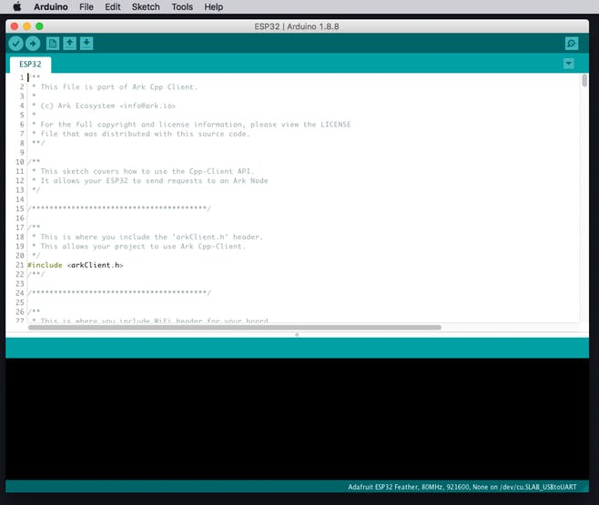

# Arduino IDE Setup

> The open-source Arduino Software (IDE) makes it easy to write code and upload it to the board. It runs on Windows, Mac OS X, and Linux. The environment is written in Java and based on Processing and other open-source software. 

The Arduino IDE is a great introductory development environment.  
It's not quite as flexible or powerful as using VSCode + PlatformIO; but for those interested in giving software or IoT a closer look, it's a great way to start exploring basic IoT usage and patterns.

[[toc]]

## Requirements

A **Linux**, **macOS**, or **Windows** computer.

There are no specific minimum system requirements for the Arduino IDE, but any fairly-recent computer from the last decade should be able to handle basic tasks.

You can even run the Arduino IDE on a Raspberry Pi (Linux Arm release), so you don't need a whole lot of horse power.  
> **note:** A more recent computer _**will**_ bring the benefit of faster compile times. 

---

## Download and Install

You can download the Arduino IDE here: 
https://www.arduino.cc/en/main/software

This is a fairly straightforward process and installs like pretty much any other desktop app.

### Linux

1) Unzip the **`arduino-1.8.9-linux[X].tar.xz`** package.
2) Run the **`install.sh`** script inside it's unzipped packages main folder.
    > **`./install.sh`**

### macOS

1) Unzip the **`arduino-1.8.9-macosx.zip`** package.
2) Drag and drop the unzipped '**Arduino.app**' into your '**Applications**' folder.

### Windows

1) Download the **`arduino-1.8.9-windows.exe`** installer.
2) Run the installer package
    > make sure you allow driver installation when you get the Windows warning popup.

> _You can also download the Arduino IDE from the [Windows App Store](https://www.microsoft.com/store/apps/9nblggh4rsd8)._

**For step-by-step instructions on installing the Arduino IDE for your system:**
| OS: | Install Guide: |
| :-- | :-------------
| Linux | https://www.arduino.cc/en/guide/linux |
| macOS | https://www.arduino.cc/en/Guide/MacOSX |
| Windows | https://www.arduino.cc/en/guide/windows |
