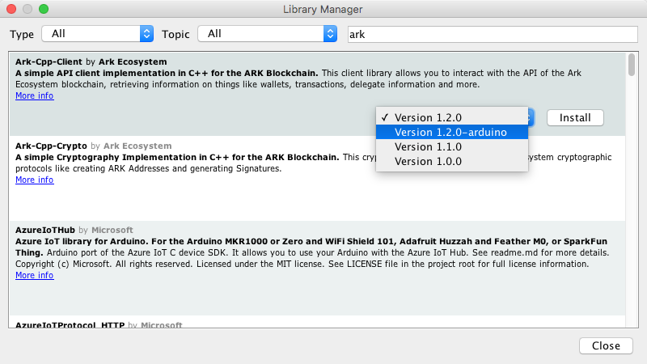
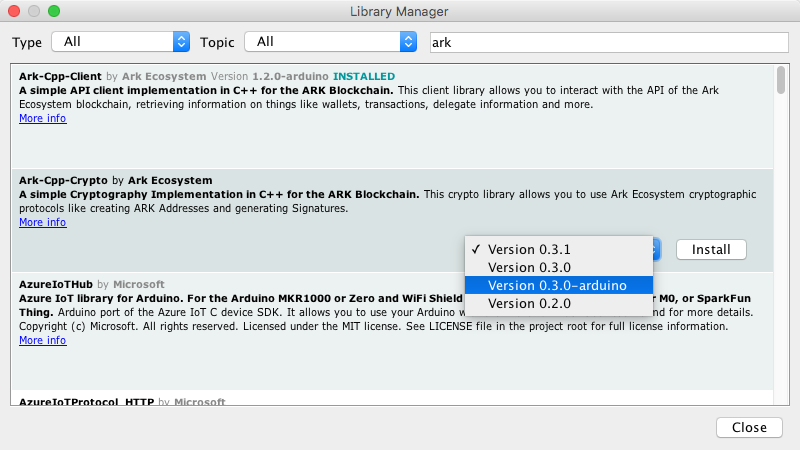
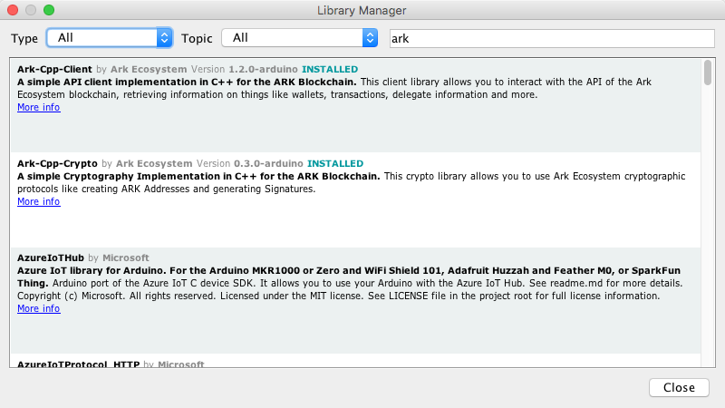
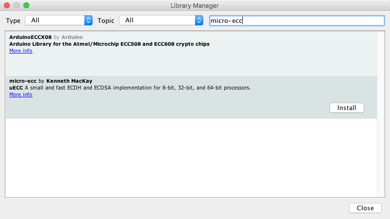
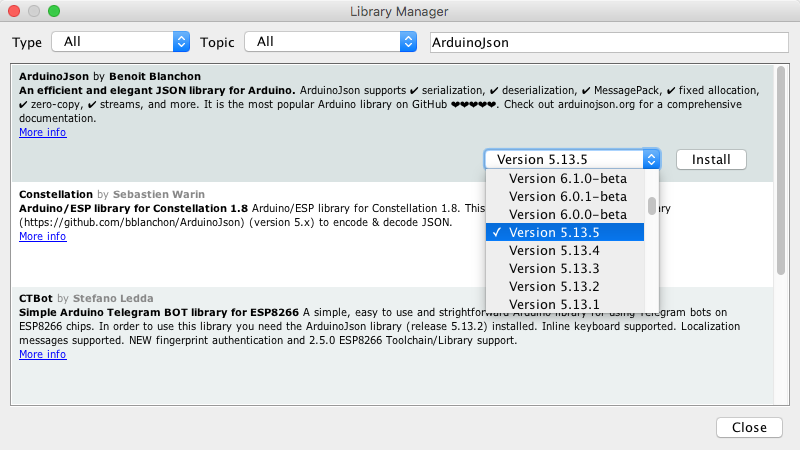
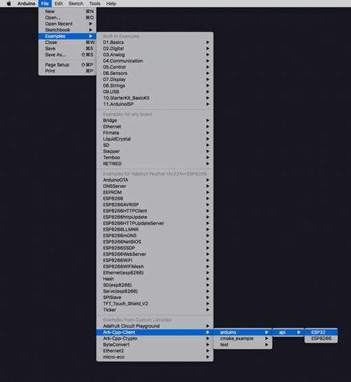

[[toc]]

# ARK Cpp SDK Setup

ARK IoT features the first crypto SDK's designed to support IoT architecture, enabling novel use-cases on platforms with otherwise constrained resources.

Currently, the ARK [Cpp-Client](https://github.com/ARKEcosystem/cpp-client) and [Cpp-Crypto](https://github.com/ARKEcosystem/cpp-crypto) SDK's are designed to run on boards and platforms like [Espressif](https://www.espressif.com/), [Arduino](https://www.arduino.cc/), [PlatformIO](https://platformio.org/).

The [**Cpp-Client**](https://github.com/ARKEcosystem/cpp-client) SDK helps developers fetch information from the [ARK blockchain](/introduction/blockchain) about its current state: which [Delegates](/glossary/#delegate) are currently forging, what transactions are associated with a given wallet, and so on.

The [**Cpp-Crypto**](https://github.com/ARKEcosystem/cpp-crypto) SDK, by contrast, assists developers in working with transactions: signing, serializing, deserializing, etc.

[[toc]]

## Arduino


There are 2 ways to install the Cpp SDK's.

1). Arduino IDE Library Manager.
2). Github.

### Arduino IDE Library Manager

Open the Arduino Library Manager:

> Sketch >> Include Library >> Manage Libraries

Search for and install both, ARK Cpp-Client and ARK Cpp-Crypto.

Be sure to install the "-arduino" versions as pictured.







#### Dependencies

We can also install the following dependencies via this same Library Manager windows.

#### Cpp-Client

None! There are currently no external dependencies for using Cpp-Client in the Arduino IDE.

#### Cpp-Crypto

Cpp-Crypto uses "micro-ecc" and "ArduinoJson"; use the Arduino Library Manager to install these packages:

- micro-ecc
- ArduinoJson

> note: be sure to use 'v5.13.5' of ArduinoJson. Do not use beta versions > v6.0.0.





---

### Github

**Cpp-Client:**

1). Clone the Cpp-Client from GitHub.

```asciidoc
git clone --branch arduino https://github.com/ARKEcosystem/cpp-client.git
```

2). Copy the Cpp-Client folder to your Arduino "/libraries" folder.

> usually ~Documents/Arduino/libraries

**Cpp-Crypto:**

1). Clone the Cpp-Crypto from GitHub.

```asciidoc
git clone --branch arduino https://github.com/ARKEcosystem/cpp-crypto.git
```

2). Copy the Cpp-Crypto folder to your Arduino "/libraries" folder.

> usually _~Documents/Arduino/libraries_

#### Dependencies for Arduino

We can download the release packages from Github or use Arduino's Library Manager. The cloned GitHub packages must be placed into our "_~Documents/Arduino/libraries_" directory.

#### Cpp-Client

None! There are currently no external dependencies for using Cpp-Client in the Arduino IDE.

#### Cpp-Crypto

- micro-ecc: [https://github.com/kmackay/micro-ecc](https://github.com/kmackay/micro-ecc)
- ArduinoJson: [https://github.com/bblanchon/ArduinoJson](https://github.com/bblanchon/ArduinoJson)
  > note: be sure to use 'v5.13.5' of ArduinoJson. Do not use beta versions > v6.0.0.

---

#### Load example Sketches directly from the Arduino 'Examples' dropdown menu

> **Files** >> **Examples** >> **ARK-Cpp-Client** >> **arduino** >> **api** >> **ESP32** > **Files** >> **Examples** >> **ARK-Cpp-Crypto** >> **arduino** >> **api** >> **ESP32**



These are example usage "Sketches" that introduce you to the basic functionality of ARK and IoT.

---

## PlatformIO


The easiest way to use the ARK SDK's in your PlatformIO project is to use the 'platformio.ini' configuration file. This file is included in every PlatformIO project.

If we want to use both, the Cpp-Client and Cpp-Crypto libraries, we could simply add the following line to the 'platformio.ini' file.

```asciidoc
lib_deps = ARK-Cpp-Client, ARK-Cpp-Crypto
```

Our 'platformio.ini' file would look like this for an Adafruit ESP32 Feather:

```asciidoc
; PlatformIO Project Configuration File
;
;   Build options: build flags, source filter
;   Upload options: custom upload port, speed and extra flags
;   Library options: dependencies, extra library storages
;   Advanced options: extra scripting
;
; Please visit documentation for the other options and examples
; https://docs.platformio.org/page/projectconf.html

[env:featheresp32]platform = espressif32
board = featheresp32
framework = arduino
lib_deps = ARK-Cpp-Client, ARK-Cpp-Crypto
upload_speed = 921600
monitor_speed = 115200

```

> The serial upload and monitor speeds could be set to 921600 and 115200 respectively, whatever your project requires.

---

Or... if we would prefer to use the command line:

### Cpp-Client

**From the command line:**

- **Using library Id:**
  > `platformio lib install 5900`
- **Using library Name:**
  > `platformio lib install "ARK-Cpp-Client"`
- **Install specific version:**
  > `platformio lib install 5900@1.2.0` > `platformio lib install "ARK-Cpp-Client@1.2.0"`

**Dependencies:**
The Dependencies should install after you install the Cpp-Client package.
You only need these if you're running the included Cpp-Client tests,
but in case you need to install those dependencies manually:

> `platformio lib -g install ArduinoJson AUnit`

### Cpp-Crypto

**From the command line:**

- **Using library Id:**
  > `platformio lib install 5899`
- **Using library Name:**
  > `platformio lib install "ARK-Cpp-Crypto"`
- **Install specific version:**
  > `platformio lib install 5899@0.3.2` > `platformio lib install "ARK-Cpp-Crypto@0.3.2"`

**Dependencies:**
The Dependencies should install after you install the Cpp-Client package.
You only needs these if you're running the included Cpp-Client tests,
but in case you need to install those dependencies manually:

> `platformio lib -g install micro-ecc bip39 AUnit`
