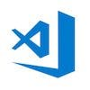
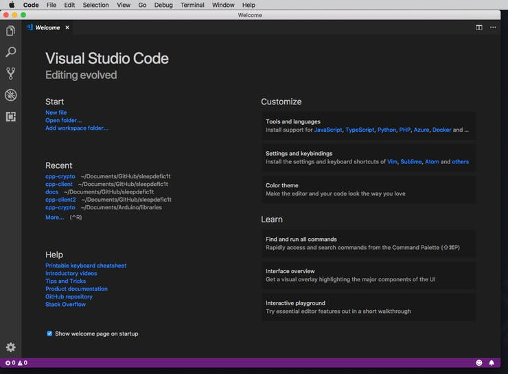
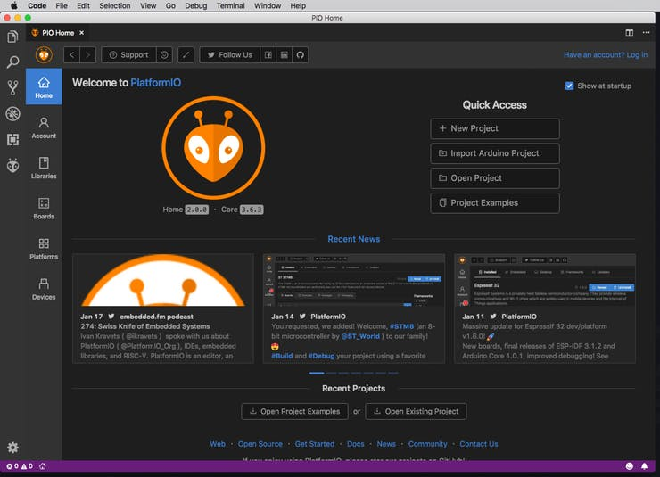

# VSCode and PlatformIO Setup

This section will discuss setting up your development environment using VSCode and PlatformIO.

VSCode and PlatformIO offer one of the most well-developed and flexible development environments for using ARK and IoT.
It even has quite a few helpful development plugins as well (linters, git, snippets, etc).

This setup is geared more towards advanced users; those who already know their way around an IDE, have coding experience, a basic understanding of IoT, and want to have more control over their projects.

[[toc]]

## VSCode

> Visual Studio Code is a lightweight but powerful source code editor which runs on your desktop and is available for Windows, macOS and Linux. It comes with built-in support for JavaScript, TypeScript and Node.js and has a rich ecosystem of extensions for other languages (such as C++, C#, Java, Python, PHP, Go) and runtimes (such as .NET and Unity).

### Requirements

- **Operating System:**
  - **Linux**
  - **macOS**
  - **Windows**
- **Minimum Hardware:**
  - 1.6 GHz or faster processor
  - 1 GB of RAM
- **Minimum Platforms:**
  - OS X Yosemite
  - Windows 7 (with .NET Framework 4.5.2), 8.0, 8.1 and 10 (32-bit and 64-bit)
  - Linux (Debian): Ubuntu Desktop 14.04, Debian 7
  - Linux (Red Hat): Red Hat Enterprise Linux 7, CentOS 7, Fedora 23
> src: **https://code.visualstudio.com/docs/supporting/requirements**

> **note:** While these are the minimum VSCode requirements,
  a more recent computer _**will**_ bring the benefit of faster compile times.

---

### Install VSCode

You can download VSCode here: '**https://code.visualstudio.com**'

This is also a fairly straightforward process and installs like pretty much any other desktop app.

#### Linux

> Debian & Ubuntu-based systems:
1) Download the **`code_1.32.x-xxxxxx_amd64.deb`** package.
2) install using the command line via **`sudo apt install ./code_1.32.x-xxxxxx_amd64.deb`**

#### macOS

1) Download unzip the **`VSCode-darwin-stable.zip`** package.
2) Drag and drop the unzipped '**Visual Studio Code.app**' into your '**Applications**' folder.

#### Windows

1) Download the **`VSCodeUserSetup-xxx-1.32.x.exe`** installer.
2) Run the installer (`.exe`) package

**For detailed instructions on installing VSCode for your system:**
| OS: | Install Guide: |
| :-- | :-------------
| Linux | https://code.visualstudio.com/docs/setup/linux |
| macOS | https://code.visualstudio.com/docs/setup/mac|
| Windows | https://code.visualstudio.com/docs/setup/windows |

---

## PlatformIO

> The next-generation integrated development environment for IoT.
C/C++ Intelligent code completion and Smart code linter with Built-in Terminal and Serial Port Monitor.

### Requirements

- **Operating System:**
  - **Linux**
  - **macOS**
  - **Windows**
- **Software:**
  - Python:
    > Python 2.7 is required. PlatformIO does not support Python 3.
    > See detailed instruction how to [Install Python Interpreter](https://docs.platformio.org/en/latest/faq.html#faq-install-python) for Windows.
  - Terminal:
    > All commands below should be executed in Command-line application (Terminal).
     > For macOS and Linux OS - Terminal application, for Windows OS – cmd.exe application.
  - Access to Serial Ports (USB/UART):
    - Windows Users: Please check that you have correctly installed USB driver from board manufacturer
    - Linux Users: Please install [99-platformio-udev.rules](https://docs.platformio.org/en/latest/faq.html#faq-udev-rules)
    - Raspberry Pi users, please read this article [Enable serial port on Raspberry Pi](https://hallard.me/enable-serial-port-on-raspberry-pi/).
> src: **https://docs.platformio.org/en/latest/installation.html#system-requirements**

There don't seem to be _concrete_ references to system hardware requirements for PlatformIO,
though your system should probably meet the miminum specs for [VSCode](https://code.visualstudio.com/docs/supporting/requirements).

### Install PlatformIO Plugin

1) Open the VSCode Extension Manager.
2) Search for official 'platformio-ide' extension.
3) Install the PlatformIO IDE.

**You can also install via Python PIP:**
> `pip install -U platformio`

**For detailed instructions on advanced PlatformIO installation for your system:**
> https://docs.platformio.org/en/latest/installation.html
