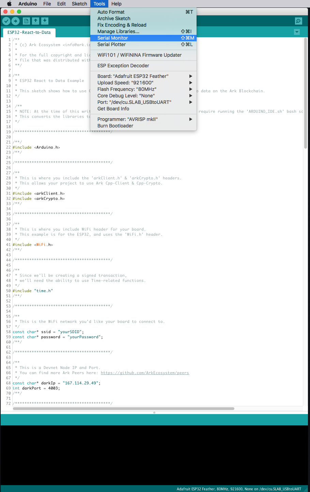
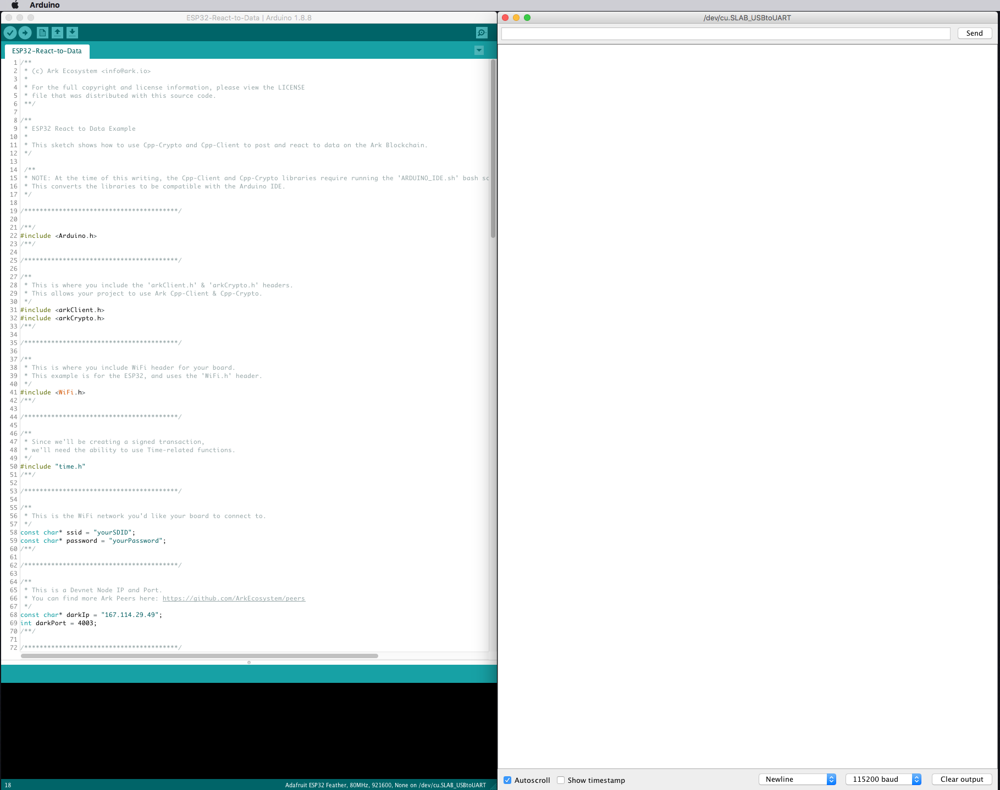
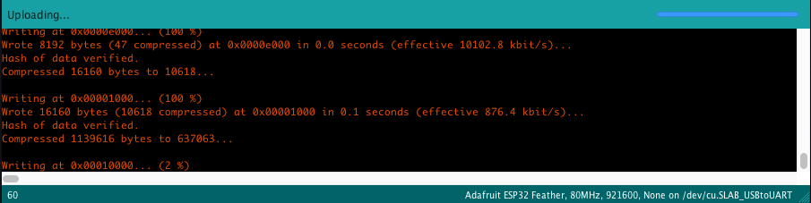
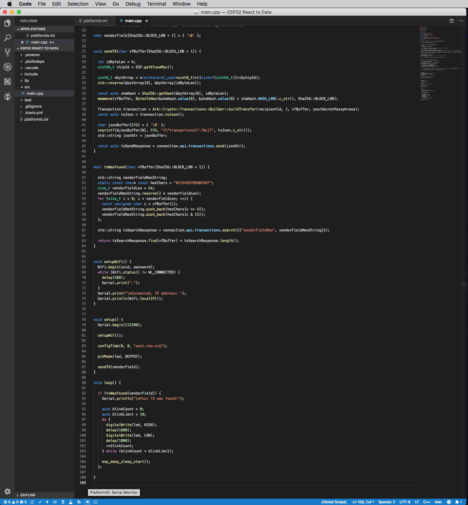
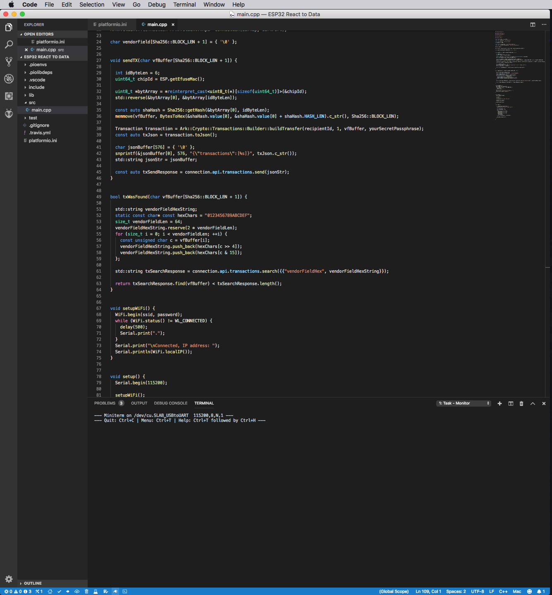
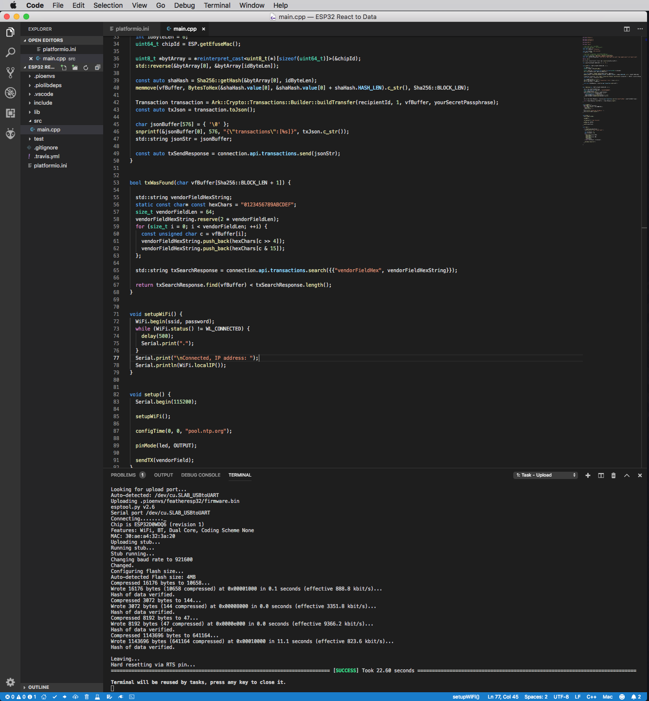
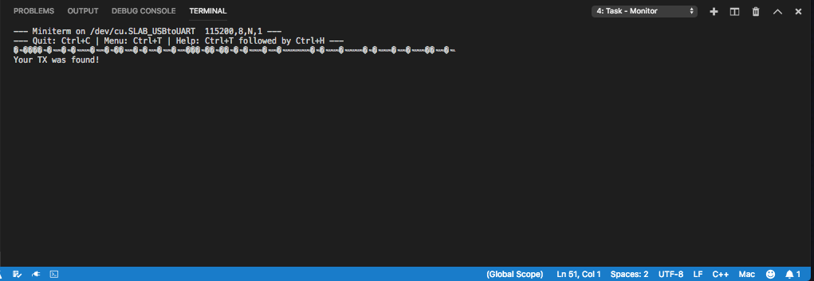

# Reacting to Data on the Blockchain

Making IoT react to data on the blockchain is rough. There's not a lot of support, and the learning curve is fairly steep. Fortunately the tools to get your project up and running are here.

This guide will serve as your own personal primer on triggering events in the real-world using data stored on the ARK blockchain.

[[toc]]

The example we will be building works on both, the Arduino IDE and with PlatformIO.
We will be using ARK Cpp-Client, Cpp-Crypto, and an Adafruit ESP32 Feather "blink" when your boards Chip ID hash is found on the [ARK blockchain](/introduction/blockchain).
With a little tweaking, you could even trigger solenoids, servos, or cloud functions depending on your projects goals.

## Step 1: Project Setup

If you're using [PlatformIO](https://platformio.org), your `platformio.ini` file should look like this:

```
; PlatformIO Project Configuration File
;
;   Build options: build flags, source filter
;   Upload options: custom upload port, speed and extra flags
;   Library options: dependencies, extra library storages
;   Advanced options: extra scripting
;
; Please visit documentation for the other options and examples
; https://docs.platformio.org/page/projectconf.html

[env:featheresp32]
platform = espressif32
board = featheresp32
framework = arduino
lib_deps = ARK-Cpp-Client, ARK-Cpp-Crypto
upload_speed = 921600
monitor_speed = 115200
```

> if you're using arduino, you can skip this `platformio.ini` part above ^

---

Open a new sketch using the [Arduino IDE](/tutorials/iot/environment/arduino), or your 'main.cpp' file if using PlatformIO.
Start by adding the headers to import Arduino, ARK Cpp-Client, and Cpp-Crypto.

```cpp
#"Include <Arduino.h>"

#include <arkClient.h>
#include <arkCrypto.h>

void setup() {
    // put your setup code here, to run once:
}

void loop() {
    // put your main code here, to run repeatedly:
}
```

The ESP32 uses the 'WiFi.h' and 'HTTPClient.h' headers to setup your WiFi connection.

```cpp
#include <WiFi.h>
#include <HTTPClient.h>
```

We also are using Cpp-Crypto's Transaction signing, and need a way to set the time, so we'll also include 'time.h'.

```cpp
#include "time.h"
```

Next, add your WiFi network and password.

```cpp
const char* ssid = "yourWiFiSSID";
const char* password = "yourWiFiPassword";
```

We will also need a Devnet peer to connect to.

::: tip
You can find more ARK peers here: [https://github.com/ARKEcosystem/peers](https://github.com/ARKEcosystem/peers)
:::

```cpp
const char* darkIp = "167.114.29.49";
int darkPort = 4003;
```

Now, we'll add your ARK Devnet [(DARK) address](/glossary/#dark-address) and your [passphrase](/faq/passphrases.html#passphrases).
Make sure to delete this passphrase from your sketch when we're finished.

```cpp
const char* recipientId = "yourARKDevnetAddress";
const char* yourSecretPassphrase = "yourSecretPassphrase";
```

We'll also define the pin of the LED we want to blink.

```cpp
#define led 13
```

Create the connection object we'll use to talk to the [ARK blockchain](/introduction/blockchain) via its [API](/api).

```cpp
ARK::Client::Connection<ARK::Client::Api> connection(darkIp, darkPort);
```

Also create a variable to store your [VendorField](/glossary/#smartbridge), this will be your board ID's hash and is what we'll be searching for on the blockchain later.

```cpp
char vendorField[Sha256::BLOCK_LEN + 1] = { '\0' };
```

Let's also configure the 'setup()' method to initialize your boards serial connection.

```cpp
void setup() {
    // put your setup code here, to run once:
    Serial.begin(115200);
}
```

Next, we'll add a method to setup and connect to your WiFi, and call that method from setup.

```cpp
void setupWiFi() {
    WiFi.begin(ssid, password);
    while (WiFi.status() != WL_CONNECTED) {
        delay(500);
        Serial.print(".");
    }
    Serial.print("\nConnected, IP address: ");
    Serial.println(WiFi.localIP());
}

void setup() {
    // put your setup code here, to run once:
    Serial.begin(115200);

    setupWiFi();
}
```

Finally, we'll add the call to configure your boards time.

```cpp
configTime(0, 0, "pool.ntp.org");
```

Your sketch should now look something like this:

```cpp
#include <Arduino.h>

#include <arkClient.h>
#include <arkCrypto.h>

#include <WiFi.h>
#include <HTTPClient.h>
#include "time.h"

const char* ssid = "yourSDID";
const char* password = "yourPassword";

const char* darkIp = "167.114.29.49";
int darkPort = 4003;

const char* recipientId = "yourARKDevnetAddress";
const char* yourSecretPassphrase = "yourSecretPassphrase";

#define led 13

ARK::Client::Connection<ARK::Client::Api> connection(darkIp, darkPort);

char vendorField[Sha256::BLOCK_LEN + 1] = { '\0' };

void setupWiFi() {
    WiFi.begin(ssid, password);
    while (WiFi.status() != WL_CONNECTED) {
        delay(500);
        Serial.print(".");
    }
    Serial.println();
    Serial.print("Connected, IP address: ");
    Serial.println(WiFi.localIP());
}

void setup() {
    // put your setup code here, to run once:
    Serial.begin(115200);

    setupWiFi();

    configTime(0, 0, "pool.ntp.org");

}

void loop() {
    // put your main code here, to run repeatedly:
}
```

## Step 2: Posting Your Data to the ARK Blockchain

Next we'll be posting data to the [blockchain](/introduction/blockchain). You can just copy this method from below into your example project

If you want to find out more about what's going here, you can check out [_**"Storing Data on the Blockchain"**_](./storing-data-on-the-blockchain.md).

```cpp
void sendTX(char vfBuffer[Sha256::BLOCK_LEN + 1]) {
    int idByteLen = 6;
    uint64_t chipId = ESP.getEfuseMac();

    uint8_t *bytArray = *reinterpret_cast<uint8_t(*)[sizeof(uint64_t)]>(&chipId);
    std::reverse(&bytArray[0], &bytArray[idByteLen]);

    const auto shaHash = Sha256::getHash(&bytArray[0], idByteLen);
    memmove(vfBuffer, BytesToHex(&shaHash.value[0], &shaHash.value[0] + shaHash.HASH_LEN).c_str(), Sha256::BLOCK_LEN);

     Transaction transaction = ARK::Crypto::Transactions::Builder::buildTransfer(recipientId, 1, vfBuffer, yourSecretPassphrase);
    const auto txJson = transaction.toJson();

    char jsonBuffer[576] = { '\0' };
    snprintf(&jsonBuffer[0], 576, "{\"transactions\":[%s]}", txJson.c_str());
    std::string jsonStr = jsonBuffer;

    const auto txSendResponse = connection.api.transactions.send(jsonStr);
}
```

## Step 3: Getting and Reacting to Data on the ARK Blockchain

Now that we have the "sending" part of the process mapped out, we'll go ahead and create the logic to search the [ARK blockchain](/introduction/blockchain) for our [VendorField](/glossary/#smartbridge).
This method should have the vendorField passed to it.

```cpp
bool txWasFound(char vfBuffer[Sha256::BLOCK_LEN + 1]) { }
```

The REST API of the [ARK blockchain](/introduction/blockchain) doesn't [search for vendorFields](/api/public/v2/transactions.html#search-for-transactions) explicitly by "string"; rather it uses the HEX representation of the vendorField string.

Let's go ahead and get the Hex of the vendorField, and place that into a string object 'vendorFieldHexString'.

```cpp
bool txWasFound(char vfBuffer[Sha256::BLOCK_LEN + 1]) {

    std::string vendorFieldHexString;
    static const char* const hexChars = "0123456789ABCDEF";
    size_t vendorFieldLen = 64;
    vendorFieldHexString.reserve(2 * vendorFieldLen);
    for (size_t i = 0; i < vendorFieldLen; ++i) {
        const unsigned char c = vfBuffer[i];
        vendorFieldHexString.push_back(hexChars[c >> 4]);
        vendorFieldHexString.push_back(hexChars[c & 15]);
    };

}
```

Next, we will search the [ARK blockchain](/introduction/blockchain) for a transaction containing our [VendorField](/glossary/#smartbridge).
The 'transaction' search method takes a string map of key-value pairs.
(std::map<std::string, std::string>)

```cpp
bool txWasFound(char vfBuffer[Sha256::BLOCK_LEN + 1]) {

    std::string vendorFieldHexString;
    static const char* const hexChars = "0123456789ABCDEF";
    size_t vendorFieldLen = 64;
    vendorFieldHexString.reserve(2 * vendorFieldLen);
    for (size_t i = 0; i < vendorFieldLen; ++i) {
        const unsigned char c = vfBuffer[i];
        vendorFieldHexString.push_back(hexChars[c >> 4]);
        vendorFieldHexString.push_back(hexChars[c & 15]);
    };

    std::string txSearchResponse = connection.api.transactions.search({{"vendorFieldHex", vendorFieldHexString}});
}
```

Finally for this 'txWasFound()' method, we return wether or not the response contains our [VendorField](/glossary/#smartbridge). If it was found, it will return 'true'; otherwise if the vendorField was not found, it will return 'false'.

```cpp
bool txWasFound(char vfBuffer[Sha256::BLOCK_LEN + 1]) {

    std::string vendorFieldHexString;
    static const char* const hexChars = "0123456789ABCDEF";
    size_t vendorFieldLen = 64;
    vendorFieldHexString.reserve(2 * vendorFieldLen);
    for (size_t i = 0; i < vendorFieldLen; ++i) {
        const unsigned char c = vfBuffer[i];
        vendorFieldHexString.push_back(hexChars[c >> 4]);
        vendorFieldHexString.push_back(hexChars[c & 15]);
    };

    std::string txSearchResponse = connection.api.transactions.search({{"vendorFieldHex", vendorFieldHexString}});

    return txSearchResponse.find(vfBuffer) < txSearchResponse.length();
}
```

## Step 4: Tying It All Together!

Now that we have set up our example and created the necessary variables to connect, send, and search for a transaction, we're ready to wrap things up by calling our 'sendTx' and 'txWasFound' methods from 'setup()' and 'loop()'.

go to your 'setup()' and 'loop()' methods:

```cpp
void setup() {
    // put your setup code here, to run once:
    Serial.begin(115200);

    setupWiFi();

    configTime(0, 0, "pool.ntp.org");
}

void loop() {
    // put your main code here, to run repeatedly:
}
```

In 'setup()', add the line to setup your boards LED with the pin you specified, and set it on OUTPUT mode.

```cpp
pinMode(led, OUTPUT);
```

Also add the method to send the transaction, 'sendTx()'.

```cpp
sendTX(vendorField);
```

'setup()' should look something like this:

```cpp
void setup() {
    //  put your setup code here, to run once:
    Serial.begin(115200);

    setupWiFi();

    configTime(0, 0, "pool.ntp.org");

    pinMode(led, OUTPUT);

    sendTX(vendorField);
}
```

Hop down to the 'loop()' method.

```cpp
void loop() {
    // put your main code here, to run repeatedly:
}
```

Let's start by placing a simple 'if' statement to check for the transaction containing your [VendorField](/glossary/#smartbridge).

```cpp
void loop() {
    // put your main code here, to run repeatedly:

    if (txWasFound(vendorField)) {
    };

}
```

Inside this 'if' statement, lets create a 'do-while' statement that will make the LED blink 10 times.

```cpp
auto blinkCount = 0;
auto blinkLimit = 10;
do {
    digitalWrite(led, HIGH);
    delay(1000);
    digitalWrite(led, LOW);
    delay(1000);
    ++blinkCount;
} while (blinkCount < blinkLimit);
```

After the "blink" section, make sure to put your board to sleep.
Looping again won't re-send the transaction, but there's no reason to keep searching for the transaction once it's found.

```cpp
esp_deep_sleep_start();
```

'loop()' should now look like this:

```cpp
void loop() {
    // put your main code here, to run repeatedly:

    if (txWasFound(vendorField)) {
        Serial.println("\nYour TX was found!");

        auto blinkCount = 0;
        auto blinkLimit = 10;
        do {
            digitalWrite(led, HIGH);
            delay(1000);
            digitalWrite(led, LOW);
            delay(1000);
            ++blinkCount;
        } while (blinkCount < blinkLimit);

        esp_deep_sleep_start();
    };

}
```

The entire sketch should look like this:

```cpp
#include <Arduino.h>

#include <arkClient.h>
#include <arkCrypto.h>

#include <WiFi.h>
#include <HTTPClient.h>

#include "time.h"

const char* ssid = "yourSDID";
const char* password = "yourPassword";

const char* darkIp = "167.114.29.49";
int darkPort = 4003;

const char* recipientId = "yourARKDevnetAddress";
const char* yourSecretPassphrase = "yourSecretPassphrase";

#define led 13

ARK::Client::Connection<ARK::Client::Api> connection(darkIp, darkPort);

char vendorField[Sha256::BLOCK_LEN + 1] = { '\0' };

void sendTX(char vfBuffer[Sha256::BLOCK_LEN + 1]) {
    int idByteLen = 6;
    uint64_t chipId = ESP.getEfuseMac();

    uint8_t *bytArray = *reinterpret_cast<uint8_t(*)[sizeof(uint64_t)]>(&chipId);
    std::reverse(&bytArray[0], &bytArray[idByteLen]);

    const auto shaHash = Sha256::getHash(&bytArray[0], idByteLen);
    memmove(vfBuffer, BytesToHex(&shaHash.value[0], &shaHash.value[0] + shaHash.HASH_LEN).c_str(), Sha256::BLOCK_LEN);

    Transaction transaction = ARK::Crypto::Transactions::Builder::buildTransfer(recipientId, 1, vfBuffer, yourSecretPassphrase);
    const auto txJson = transaction.toJson();

    char jsonBuffer[576] = { '\0' };
    snprintf(&jsonBuffer[0], 576, "{\"transactions\":[%s]}", txJson.c_str());
    std::string jsonStr = jsonBuffer;

    const auto txSendResponse = connection.api.transactions.send(jsonStr);
}

bool txWasFound(char vfBuffer[Sha256::BLOCK_LEN + 1]) {

    std::string vendorFieldHexString;
    static const char* const hexChars = "0123456789ABCDEF";
    size_t vendorFieldLen = 64;
    vendorFieldHexString.reserve(2 * vendorFieldLen);
    for (size_t i = 0; i < vendorFieldLen; ++i) {
        const unsigned char c = vfBuffer[i];
        vendorFieldHexString.push_back(hexChars[c >> 4]);
        vendorFieldHexString.push_back(hexChars[c & 15]);
    };

    std::string txSearchResponse = connection.api.transactions.search({{"vendorFieldHex", vendorFieldHexString}});

    return txSearchResponse.find(vfBuffer) < txSearchResponse.length();
}

void setupWiFi() {
    WiFi.begin(ssid, password);
    while (WiFi.status() != WL_CONNECTED) {
        delay(500);
        Serial.print(".");
    }
    Serial.print("\nConnected, IP address: ");
    Serial.println(WiFi.localIP());
}

void setup() {
    Serial.begin(115200);

    setupWiFi();

    configTime(0, 0, "pool.ntp.org");

    pinMode(led, OUTPUT);

    sendTX(vendorField);
}

void loop() {
    // put your main code here, to run repeatedly:

    if (txWasFound(vendorField)) {
        Serial.println("\nYour TX was found!");

        auto blinkCount = 0;
        auto blinkLimit = 10;
        do {
            digitalWrite(led, HIGH);
            delay(1000);
            digitalWrite(led, LOW);
            delay(1000);
            ++blinkCount;
        } while (blinkCount < blinkLimit);

        esp_deep_sleep_start();
    };

}
```

## Step 5: Running Your Example!!

### Arduino

Plug your ESP32 into your computer via USB, and open the serial monitor.




Press the arrow at the top left to upload the sketch to your board.


You can see the compiler doing its thing in that window to the bottom left. This is also where any errors or warning would show up.



After the sketch is flashed to your board, you should get a response in the serial monitor.
This is what it will look like when your TX has been found on the ARK blockchain.
Your ESP32 should also be blinking!


### PlatformIO

Plug your ESP32 into your computer via USB, and open the serial monitor.




Press the arrow towards the bottom left to upload the sketch to your board.
You can see the compiler doing its thing in that window to the bottom right. This is also where any errors or warning would show up.


After the sketch is flashed to your board, you should get a response in the serial monitor!



This is what it will look like when your TX has been found on the ARK blockchain.
Your ESP32 should also be blinking!



---

Congrats, you just posted AND reacted to data on a public blockchain!! :tada: :confetti_ball:

From here, the sky is the limit!
We can now leverage the power of the [ARK blockchain](/introduction/blockchain) and its [VendorField](/glossary/#smartbridge). We could trigger alerts and notifications, even control things in the physical world! Set up a solenoid to unlock a door, create a vending machine, rent access to your robotics or e-transportation project... any of a million different configurations and possibilities.
