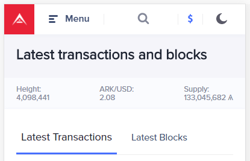
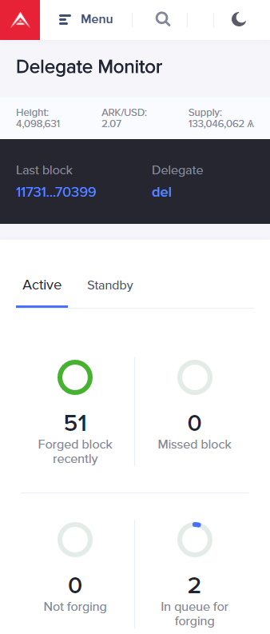

# How to use the Ark Explorer on Mobile

## What is a block explorer?

If a blockchain is a highway of transactional records, from the very first to the most current, a block explorer is your Hollywood tour bus: the guide to every aspect of that highway as you travel through it. Most people, when using the block explorer, are only doing so to confirm a transaction they have sent or are receiving, this, however, taps into a tiny fraction of the power contained within the explorer.
Block explorers can give anyone access to all the information contained within that blockchain. You can search every block that was ever created, see every transaction an address has conducted as well as a snapshot of the status of that network.
Most blockchains have a block explorer, and Ark is no different; however, we pride ourselves on making all our interfaces intuitive and easy to read for users of any level.

Let’s begin our journey into the Ark explorer.

When you first arrive at [explorer.ark.io](https://explorer.ark.io), you will find some immediately available information.

## Latest Transactions

This is a list of the most recent transactions to have been broadcast over the network. Inside each transaction details page, you will be able to view the following information:

- **ID:** This will show the unique identification (ID) hash for this transaction. If you click on this ID, you will be able to see how many confirmations it has received and what block it has been included in. By being incorporated into a block, it proves the network has accepted the transaction as valid, and it will forever be written into the Ark blockchain.

- **Amount:** This will indicate the amount of ARK that was sent from the Sender to the Recipient.

- **Sender:** This field shows the Ark address which signed the transaction; i.e., who is sending the transaction.
  
- **Recipient:** Here we see the Ark address to which the sender (above) sent this transaction to; i.e., who is receiving the transaction.
  
- **Timestamp:** This indicates the exact time at which the transaction was broadcasted and accepted by the network.
  
- **Fee:** This indicates the fee paid to send the transaction. A list of current fees on the ARK network can be found in [**Fees for Transactions**](https://docs.ark.io/basics/understanding-transactions-and-block-propagation.html#fees-for-transactions).
  
- **SmartBridge:** This field indicates the Ark SmartBridge that was used in the transaction. SmartBridges are part of the innovations driving the Ark Ecosystem: it allows for different blockchains to interact with each other. Think of each blockchain as an island with no outside communication. If you work on Ethereum Island and your business partner only works on Bitcoin Island, you can't trade or work together. Ark SmartBridges are like an airstrip, cargo barge, cellphone towers, and internet all rolled into one. You can do business with any of the other islands from any island instantaneously and friction free. A more detailed explanation of SmartBridges can be found in the section [**What are BridgeChains and how to use them**](https://docs.ark.io/basics/how-does-ark-smartbridge-work.html).

### Latest Blocks

This is a list of the most recent blocks to have been broadcast over the network. Inside each block details page, you will be able to view the following information:

- **ID:** This will the show unique identification (ID) hash for the forged block.  If you want to learn more about "blockchain", refer to our section on [**What is The Blockchain?**](https://docs.ark.io/blockchain/what-is-the-blockchain.html) and [**When Do You Need A Blockchain?**](https://docs.ark.io/blockchain/when-do-you-need-a-blockchain.html).

- **Height:** This section will show how far from the first (genesis) block the blockchain has progressed. For example, if you are looking at a block with a height of 1000, this will indicate that the block is the 999th since the first (genesis) block.

- **Timestamp:** This indicates the date and time at which block was forged and committed onto the Ark blockchain.

- **Transactions:** Here you will see how many transactions were included in the block.

- **Generated By:** Refers to which delegate forged the specific block. For more information on Delegated Proof of Stake and delegates, refer to our section on [**What is DPOS and how it relates to other consensus mechanisms.**](https://docs.ark.io/basics/what-is-delegated-proof-of-stake.html).

- **Amount:** Indicates the sum of ARK for all transactions in the block.

- **Fee:** Shows the total fees associated with all the block's transactions.

### Network Information

Across the top of the page, you will also see a list of details about the current state of the network you are viewing:

- **Height:** This is a live view of how many blocks have been created since the first (genesis) block.

- **ARK/Currency:** This indicates the current price of ARK in your chosen currency. This will often be automatically set to the national currency of wherever you are connecting to the internet from. For mobile users, in the upper right-hand corner, you can change this setting by clicking on the currency icon.

- **Supply:** This area shows the total supply of ARK in existence. In ARK's case, this number goes up over time by a set number of coins every year.
- **Network:** This indicates whether you are viewing the Mainnet, Testnet or Devnet. Mainnet is where transactions are conducted and settled in real time. In contrast, the test and dev networks are used by developers to test functionality before introducing features or other applications onto the mainnet. For most users, the Mainnet is most relevant.

- **Market Cap:** This refers to the market capitalization of ARK, which is the value obtained by multiplying the Supply by the current price of a coin.

## Top Menu Bar

**Ark Icon:** Returns to the Ark explorer home page.

**Drop Down Menu:**

- **Home:** This will take you back to the Ark explorer home page.

- **Top Wallets:** This will show you the wallets, ordered high to low by balance. From there, you will be able to see their ranking, wallet address, balance and the percentage of the total supply they own. Currently, the Ark development team holds the most significant portion of ARK, which is used to pay for projects and developers to bring network improvements and community support.

- **Delegate Monitor:** This shows the current list of delegates and all the votes they've earned. Ark is run by its community, whose members vote for delegates. Delegates, among other things, participate in community matters and forge blocks. The top 51 delegates are allowed to forge. Many delegates rely on community support to maintain their position within the network.

The delegate monitor shows two tabs: **"Active"** and **"Standby"**.
"Active" will list the current top 51 active delegates, an overview of blocks recently forged, blocks missed, delegates who are not forging and those delegates waiting to forge the next blocks.

If you click on a delegate’s username, you will be taken to the delegate's wallet address page and see the following information:

- **Balance:** Total amount of ARK in the delegate's wallet.

- **Transactions:** Green arrows indicate the number of transactions into the delegate's wallet, while red arrows indicate transactions OUT of the delegate's wallet.

- **Uptime:** Indicates the percentage of time the delegate's node has been connected to the network. When delegate nodes are not online, they are not forging (verifying) new blocks. Thus this can be an essential aspect for Ark community members to consider when voting.

- **Rank/Status:** This shows what the delegate's ranking is regarding vote weight. For example, seeing the number 6 means the delegate has the sixth highest number of votes of all the delegates in the network.
  
- **Approval:** This field will show the percentage of the total votes they control. If this shows 5%, then it means that 5% of all ARK in the network is pledged to that delegate.

- **Forged:** Indicates the total amount of ARK they have been rewarded through forging (verifying) blocks.

- **Blocks:** Shows the total number of blocks this delegate has forged on the network.

- **Votes:** Whom this wallet has cast their delegate vote towards.

- **Voters:** How many total voters have pledged to the delegate.

The last three menu option are as follows:

## Search Bar

Here you can input any Ark address, transaction ID or block ID and find detailed information about them. Most users will use this to check the status of a transaction they have sent or are expecting. If you were to send someone a transaction of 5 ARK, a transaction ID would be generated, and you could forward that information to the recipient as both a validation of payment and a digital receipt.

## Day/Night Mode

This is merely an aesthetic choice depending on the user and how they prefer the interface to look. When browsing the [Devnet block explorer](https://dexplorer.ark.io), the Night theme is enabled by default.

## Conclusion

With this information, you can now take advantage of the full breadth of functionality contained within the Ark explorer. While this may seem like a simple tool, it is also powerful. Block explorers help individuals see what the blockchain is up to!
