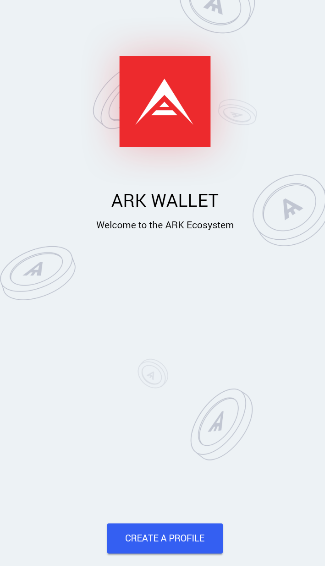

# How to Use the Mobile Wallet

The ARK Mobile Wallet is an easy to use, portable application. It enables you to manage all of your ARK accounts and view information about delegates. The wallet also provides an interface to add contacts by their address, which can save you some time when making transactions.

The application is built using the Ionic Framework, which enables the code base to be reused, keeping similar functionally and looks, for both iOS and Android.

## Installation

Like any useful application, you will be able to find the ARK Mobile Wallet application in your phone's store. It is entirely free to download and use.

Download the wallet from the [App Store](https://itunes.apple.com/us/app/mobile-ark/id1324625967?ls=1&mt=8) or the [Google Play Store](https://play.google.com/store/apps/details?id=io.ark.wallet.mobile).

## Starting the ARK Wallet

Once you load the application you will be met with this screen:

The content of each slide shares some details about some security and usability features of the app.

After reading through the welcome slides, you will be able to create a profile.

After you hit the ***Create A Profile*** button, you will be prompted to create a six-digit PIN confirm it afterward.

::: warning
It is imperative that you remember this PIN.
:::

Your new profile must then be assigned a name and a network. Mainnet is the one where your ARK tokens will be sent to and from. The Devnet is used for team members and contributors wishing to test additional functionality and should not be used. The remainder of this document assumes you've created a profile that uses the Mainnet.

Once you have entered your name, you can sign in by touching the profile you created and by entering the PIN you created earlier. From there, you can click on the bottom-right button to either create or import a wallet. If you are importing a wallet, click [here](#importing-a-wallet). If you are creating a new wallet, continue reading.

## Creating a wallet

If you choose to generate a wallet, follow the prompts and you should be shown your shareable Public Address and your Secret Passphrase.

::: warning
Keep your secret passphrase safe and secure, without it, you will not be able to restore your wallet, and you will lose all of your ARK tokens.
:::

After hitting ***Next***, you will be asked to verify your Secret Passphrase. Your PIN will be required to encrypt your address.

The next screen will show you the amount of ARK tokens you have in your wallets, your shareable Public Address, the Market Value of ARK in USD, Satoshis, and the 24-hour Change.

             

## Importing a wallet

If you choose to import a wallet and follow the prompts, you will have two options to import your wallet: QR Code or by putting in your secret passphrase or address manually.

::: warning
If you decide to copy and paste your information into the app, make sure your device does not add a space after your passphrase or address. If a space is there, it will create a new wallet and not import your wallet.
:::

## The ARK Wallet

You can hit the triple bar in the top left corner, doing so will give you numerous options for you to select.

Choosing ***Wallets*** will place you at the main ARK Wallet balance screen. After you reach the main ARK Wallet balance screen, you can add another wallet, touch the triple bar on the top left corner, or choose an existing wallet to view even closer.
If you want to add another wallet,  push the blue circle we used earlier to create or import a wallet.
If you hit the triple bar on the top left corner, you get numerous options where you can view and select:

- Main wallet balance screen
- Vote for delegates
- Change the peer to the network
- Enter the settings, where you may change or view your:
  - Language
  - Currency
  - PIN
  - Clear your Data
  - Privacy Policy
  - Version Number
- Contacts
  - You can save contacts by name and ARK Address for quicker sending/receiving
- Sign Out

            

If you want to view an existing wallet and the transaction history, you will need to touch the rectangle(s) right below the ***Total Balance*** text.

Once inside a wallet, you can view incoming and receiving transaction history, the public address, the ARK wallet balance and by touching the vertical ellipsis you can:

- Register a Delegate
- Vote for a Delegate
- Rename your wallet
- Backup your Wallet
- Delete your wallet

## Voting

To begin voting, we need ARK in our wallets. Once you've transferred ARK to your wallet, you will want to click on the wallet that was either imported or generated.

Once the wallet has been selected, hit the triple bar and choose ***Delegates***. This will show you the top 51 Active Delegates and the delegates on standby

Choosing a Delegate will prompt you to vote for 1 ARK.

## Conclusion

Your ARK Mobile Wallet is now ready for use! That's all it takes to install the ARK wallet. If you have any questions regarding voting and delegates, take a look at the [Glossary](/glossary/) or ARK's [FAQ](https://blog.ark.io/ark-frequently-asked-questions-faq-bcb90a0537cc)!
